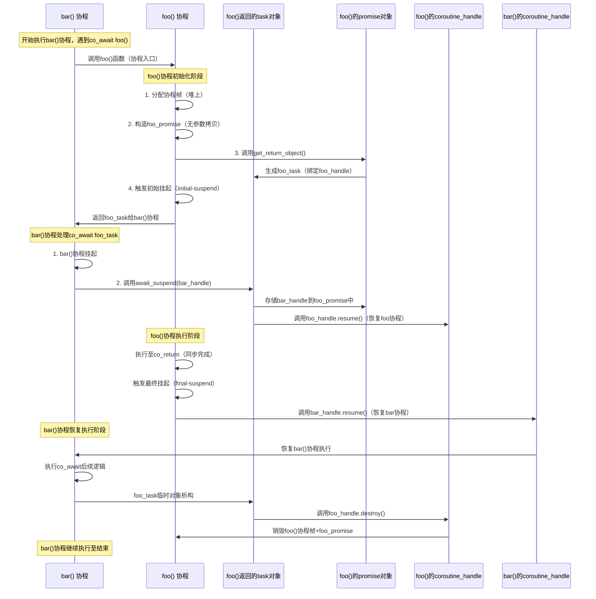
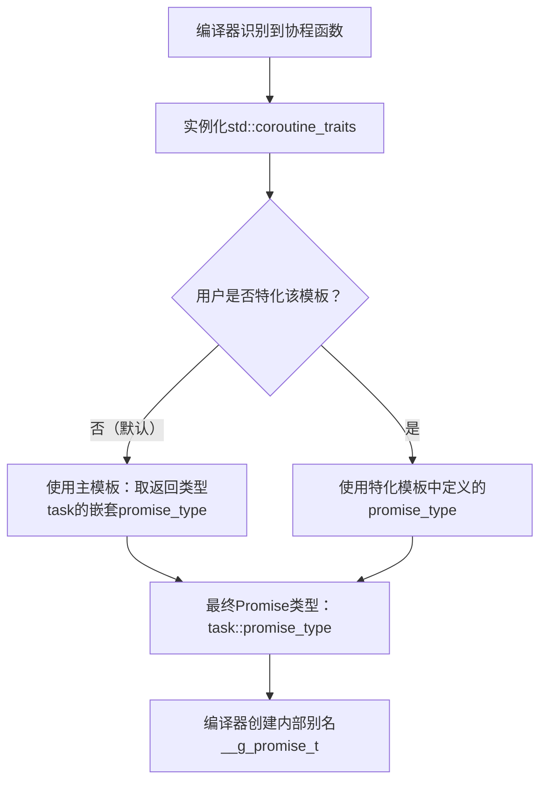

# [Coroutines](https://lewissbaker.github.io/2017/11/17/understanding-operator-co-await)

- [Coroutines](#coroutines)
  - [Refs](#refs)
  - [Basic Ideas](#basic-ideas)
    - [What does the Coroutines TS give us?](#what-does-the-coroutines-ts-give-us)
    - [Understanding](#understanding)
      - [什么是协程](#什么是协程)
      - [协程的状态](#协程的状态)
      - [协程的挂起](#协程的挂起)
      - [协程的返回值](#协程的返回值)
      - [协程体抛出异常](#协程体抛出异常)
      - [协程体的执行](#协程体的执行)
  - [Understanding operator `co_await`](#understanding-operator-co_await)
    - [Awaiters and Awaitables: Explaining operator `co_await`](#awaiters-and-awaitables-explaining-operator-co_await)
    - [Explain in cppreference](#explain-in-cppreference)
    - [When the compiler sees a `co_await <expr>` expression there are actually a number of possible things it could be translated to depending on the types involved.](#when-the-compiler-sees-a-co_await-expr-expression-there-are-actually-a-number-of-possible-things-it-could-be-translated-to-depending-on-the-types-involved)
    - [Obtaining the Awaiter](#obtaining-the-awaiter)
    - [Awaiting the Awaiter](#awaiting-the-awaiter)
    - [Coroutine Handles](#coroutine-handles)
  - [Synchronisation-free async code](#synchronisation-free-async-code)
    - [Comparison to Stackful Coroutines](#comparison-to-stackful-coroutines)
    - [Avoiding memory allocations](#avoiding-memory-allocations)
    - [Example](#example)
  - [`Promise` Interface](#promise-interface)
    - [分配协程帧](#分配协程帧)
      - [Customising coroutine frame memory allocaiton](#customising-coroutine-frame-memory-allocaiton)
    - [拷贝参数到协程帧](#拷贝参数到协程帧)
    - [Constructing the promise object](#constructing-the-promise-object)
    - [Obtaining the return object](#obtaining-the-return-object)
    - [The initial-suspend point](#the-initial-suspend-point)
    - [Returning to the caller](#returning-to-the-caller)
    - [Returning from the coroutine using `co_return`](#returning-from-the-coroutine-using-co_return)
    - [Handling exceptions that propagate out of the coroutine body](#handling-exceptions-that-propagate-out-of-the-coroutine-body)
    - [The final-suspend point](#the-final-suspend-point)
    - [How the compiler chooses the promise type](#how-the-compiler-chooses-the-promise-type)
    - [Identifying a specific cotoutine activation frame](#identifying-a-specific-cotoutine-activation-frame)
    - [自定义 co\_await 的行为](#自定义-co_await-的行为)
      - [用途一：启用非可等待类型的 `co_await` 支持](#用途一启用非可等待类型的-co_await-支持)
      - [用途二：禁用特定类型的 `co_await`](#用途二禁用特定类型的-co_await)
      - [用途三：适配已有可等待类型的行为](#用途三适配已有可等待类型的行为)
      - [必须提供 fallback 重载（兼容默认行为）](#必须提供-fallback-重载兼容默认行为)
    - [自定义 co\_yield 的行为](#自定义-co_yield-的行为)
  - [Understanding Symmetric Transfer](#understanding-symmetric-transfer)
    - [假设有如下执行流](#假设有如下执行流)
    - [朴素Task概要](#朴素task概要)
    - [完善`Task::promise_type`](#完善taskpromise_type)
    - [完善`task::operator co_await()`](#完善taskoperator-co_await)
    - [The stack-overflow problem](#the-stack-overflow-problem)
    - [The Coroutines TS solution](#the-coroutines-ts-solution)
    - [The problems](#the-problems)
    - [Enter Symmetric Transfer](#enter-symmetric-transfer)
    - [修正 `Task` 的实现](#修正-task-的实现)
    - [Symmetric Transfer as the Universal Form of await\_suspend](#symmetric-transfer-as-the-universal-form-of-await_suspend)
  - [Compiler Transform](#compiler-transform)
    - [Step 1. Determining the promise type](#step-1-determining-the-promise-type)
    - [Step 2: Creating the coroutine state](#step-2-creating-the-coroutine-state)
    - [Step 3: Call `get_return_object()`](#step-3-call-get_return_object)

## Refs

- [Coroutine Theory](https://lewissbaker.github.io/2017/09/25/coroutine-theory)
- [C++ Coroutines: Understanding operator co_await](https://lewissbaker.github.io/2017/11/17/understanding-operator-co-await)
- [C++ Coroutines: Understanding the promise type](https://lewissbaker.github.io/2018/09/05/understanding-the-promise-type)
- [C++ Coroutines: Understanding Symmetric Transfer](https://lewissbaker.github.io/2020/05/11/understanding_symmetric_transfer)
- [C++ Coroutines: Understanding the Compiler Transform](https://lewissbaker.github.io/2022/08/27/understanding-the-compiler-transform)

- [Coroutines](https://en.cppreference.com/w/cpp/language/coroutines)
- [Coroutines and Reference Parameters](https://toby-allsopp.github.io/2017/04/22/coroutines-reference-params.html)

- [Yet Another C++ Coroutine Tutorial](https://theshoemaker.de/posts/yet-another-cpp-coroutine-tutorial)
- [andreasbuhr cppcoro](https://github.com/andreasbuhr/cppcoro)
- [C++20 Coroutines and io_uring](https://pabloariasal.github.io/2022/11/12/couring-1/)
- [渡劫 C++ 协程](https://www.bennyhuo.com/2022/03/09/cpp-coroutines-01-intro/)

- [librf是一个基于C++20 coroutines编写的无栈协程库](https://github.com/tearshark/librf)
- [C++20 Coroutine 性能测试 (附带和libcopp/libco/libgo/goroutine/linux ucontext对比)](https://owent.net/2019/1911.html)

## Basic Ideas

### What does the Coroutines TS give us?

* Three new language keywords: `co_await`, `co_yield` and `co_return`
  * `co_yield expr` 等价于 `co_await promise.yield_value(expr)`
* Several new concepts:
  * `coroutine_state` : 记录协程状态，C++ 协程会在开始执行时的第一步就使用 operator new 来开辟一块内存来存放
  * `coroutine_handle<P>` : 协程的唯一标识，用于恢复执行或者销毁协程帧
  * `coroutine_traits<Ts...>`
  * `promise` : 协程的状态信息，用于存储协程的状态信息，包括协程的返回值、协程的异常信息等
  * `awaiter` : 用于控制 `co_await` 表达式的语义，包括是否挂起协程、在挂起后执行某些逻辑、在恢复时执行某些逻辑来处理 `co_await` 的返回值。标准库当中提供了两个非常简单直接的等待体
    * `suspend_always` : 总是挂起
    * `suspend_never` : 总是不挂起
* A general mechanism that library writers can use to interact with coroutines and customise their behaviour.
* A language facility that makes writing asynchronous code a whole lot easier!

协程提案并没有明确规定协程的语义（semantics），而是定义了一个通用的机制，使得库代码可以通过实现符合特定接口的类型，来定制化协程的行为。

**提案定义了两类主要的接口：`Promise` `Awaitable`**

- `Promise`接口定义了定制协程自身行为的方法：库作者可以定制coroutine在 `called`、`return`时的行为，以及协程内`co_await`、`co_yield`表达式的行为（指`await_transform`接口）

- `Awaitable`接口定义了控制`co_await`语义的方法：当一个变量是 `co_await`ed，那么编译器会生成一系列可指定的针对 `awaitable` 变量的方法，这些方法包括：是否挂起当前协程、在挂起后执行某些逻辑、在恢复时执行某些逻辑来处理`co_await`的返回值。

### Understanding

#### 什么是协程

协程就是一段可以挂起（suspend）和恢复（resume）的程序，一般而言，就是一个支持挂起和恢复的函数。

#### 协程的状态

协程挂起时，我们需要记录函数执行的位置，C++ 协程会在开始执行时的第一步就使用 operator new 来开辟一块内存来存放这些信息，这块内存或者说这个对象又被称为协程的状态（coroutine state）。

#### 协程的挂起

C++ 通过 co_await 表达式来处理协程的挂起，表达式的操作对象则为等待体（awaiter）

**实现了`await_ready`、`await_suspend`、 `await_resume`接口的类型被称为`Awaiter`**

1.  `await_ready` 返回 bool 类型，如果返回 true，则表示已经就绪，无需挂起；否则表示需要挂起。

```cpp
struct suspend_never {
  constexpr bool await_ready() const noexcept { return true; }
  ...
};

struct suspend_always {
  constexpr bool await_ready() const noexcept { return false; }
  ...
};
```  

2. `await_ready` 返回 false 时，协程就挂起了。这时候协程的局部变量和挂起点都会被存入协程的状态当中，`await_suspend` 被调用到。

```cpp
??? await_suspend(std::coroutine_handle<> coroutine_handle);
```

参数 `coroutine_handle` 用来表示当前协程，`await_suspend` 函数的返回值类型对应着不同的行为：
  * 返回 void 类型或者返回 true，表示当前协程挂起之后将执行权还给当初调用或者恢复当前协程的函数。
  * 返回 false，则恢复执行当前协程。注意此时不同于 await_ready 返回 true 的情形，此时协程已经挂起，await_suspend 返回 false 相当于挂起又立即恢复。
  * 返回其他协程的 coroutine_handle 对象，这时候返回的 coroutine_handle 对应的协程被恢复执行。
  * 抛出异常，此时当前协程恢复执行，并在当前协程当中抛出异常。

3. 协程恢复执行之后，等待体的 await_resume 函数被调用。同样地，await_resume 的返回值类型也是不限定的，返回值将作为 co_await 表达式的返回值。

```cpp
??? await_resume()；
```

#### 协程的返回值

**在 C++ 当中，一个函数的返回值类型如果是符合协程的规则的类型，那么这个函数就是一个协程。**

这个协程的规则，就是返回值类型能够实例化如下模板。也就是说，返回值类型 _Ret 能够找到一个类型 _Ret::promise_type 与之相匹配。这个 promise_type 既可以是直接定义在 _Ret 当中的类型，也可以通过 using 指向已经存在的其他外部类型。

```cpp
template <class _Ret, class = void>
struct _Coroutine_traits {};

template <class _Ret>
struct _Coroutine_traits<_Ret, void_t<typename _Ret::promise_type>> {
    using promise_type = typename _Ret::promise_type;
};

template <class _Ret, class...>
struct coroutine_traits : _Coroutine_traits<_Ret> {};

struct Result {
  struct promise_type {

    Result get_return_object() {
      // 创建 Result 对象
      return {};
    }

    ...
  };
};
```

此外，Result对象的创建，应当由 promise_type 通过 get_return_object 接口来获得。不同于一般的函数，协程的返回值并不是在返回之前才创建，而是在协程的状态创建出来之后马上就创建的。也就是说，协程的状态被创建出来之后，会立即构造 promise_type 对象，进而调用 get_return_object 来创建返回值对象。

promise_type 类型的构造函数参数列表如果与协程的参数列表一致，那么构造 promise_type 时就会调用这个构造函数。否则，就通过默认无参构造函数来构造 promise_type。

```cpp
// 对于返回一个值的情况，需要在 promise_type 当中定义一个函数
struct Result {
  struct promise_type {
    void return_value(int value) {
      ...
    }
    ...
  };
};

Result Coroutine() {
  ...
  co_return 1000;   // return_value 函数的参数 value 的值为 1000
}

// 也支持返回 void。只不过 promise_type 要定义的函数是 return_void 
struct Result {
  struct promise_type {
    void return_void() {
      ...
    }
    ...
  };
};

Result Coroutine() {
  ...
  co_return;
};

// 如果调用co_yield，对应的函数是yield_value
struct Result {
  struct promist_type {
    R yield_value(T v);
  };
};

Result Coroutine() {
  ...
  co_yield (T)v;  // co_await Result.yield_value(v);
}
```

#### 协程体抛出异常

```cpp
struct Result {
  struct promise_type {
    void unhandled_exception() {
      exception_ = std::current_exception(); // 获取当前异常
    }
    ...
  };
};
```

#### 协程体的执行

在协程的返回值被创建之后，协程体就要被执行了。

1. 为了便于扩展，协程体执行第一步就是调用 `co_await promise.initial_suspend()`，其返回值是一个awaiter，可以通过这个awaiter来实现协程的调度
2. 然后执行协程体，协程体当中会存在 co_await、co_yield、co_return 三种协程特有的调用
3. 当协程执行完成或者抛出异常之后会先清理局部变量，接着调用 final_suspend 来方便开发者自行处理其他资源的销毁逻辑。final_suspend 也可以返回一个等待体使得当前协程挂起，但之后当前协程应当通过 coroutine_handle 的 destroy 函数来直接销毁，而不是 resume。

## Understanding operator `co_await`

### Awaiters and Awaitables: Explaining operator `co_await`

> The `co_await` operator can only be used within the context of a coroutine. This is somewhat of a tautology though, since any function body containing use of the `co_await` operator, by definition, will be compiled as a coroutine.

- 一元运算符，仅可以在协程上下文内使用（**本质上，包含co_await的任意方法，都会被编译为一个协程**）(tautology: 同义反复)

- **支持`co_wait`运算符的类型被称为`Awaitable`**
  - `co_await` 操作符能否应用于某一类型取决于 `co_await` 表达式出现的上下文。`promise` 类型可以通过其 `await_transform` 方法改变例行程序 `co_await` 表达式的含义

* `Normally Awaitable`:  a type that supports the co_await operator in a coroutine context whose promise type does not have an await_transform member. 
* `Contextually Awaitable`: a type that only supports the co_await operator in the context of certain types of coroutines due to the presence of an await_transform method in the coroutine’s promise type.

- **实现了`await_ready`、`await_suspend`、 `await_resume`接口的类型被称为`Awaiter`**

- 一个类型可以同时是`Awaitable`和`Awaiter`

### Explain in cppreference

The unary operator co_await suspends a coroutine and returns control to the caller. Its operand is an expression that either (1) is of **a class type that defines a member operator `co_await`** or may **be passed to a non-member operator `co_await`**, or (2) is **convertible to such a class type by means of the current coroutine's `Promise::await_transform`**.

```cpp
co_await expr
```

First, expr is converted to an awaitable as follows:

- if expr is produced by an initial suspend point, a final suspend point, or a yield expression, the awaitable is expr, as-is.
- otherwise, if the current coroutine's Promise type has the member function await_transform, then the awaitable is promise.await_transform(expr).
- otherwise, the awaitable is expr, as-is.

Then, the awaiter object is obtained, as follows:

- if overload resolution for operator co_await gives a single best overload, the awaiter is the result of that call:
  - awaitable.operator co_await() for member overload,
  - operator co_await(static_cast<Awaitable&&>(awaitable)) for the non-member overload.
- otherwise, if overload resolution finds no operator co_await, the awaiter is awaitable, as-is.
- otherwise, if overload resolution is ambiguous, the program is ill-formed.

### When the compiler sees a `co_await <expr>` expression there are actually a number of possible things it could be translated to depending on the types involved.

### Obtaining the Awaiter

**编译器首先做的就是为等待值（awaited value）生成包含`Awaiter`对象的代码。**，对于 `co_await <expr>` 表达式当中 `expr` 的处理，C++ 有一套完善的流程：

1. 如果 promise_type 当中定义了 await_transform 函数，那么先通过 `promise.await_transform(expr)` 来对 expr 做一次转换，得到的对象称为 awaitable；否则 awaitable 就是 expr 本身。
2. 接下来使用 awaitable 对象来获取等待体（awaiter）。如果 awaitable 对象有 operator co_await 运算符重载，那么等待体就是 `operator co_await(awaitable)`，否则等待体就是 awaitable 对象本身。

> Assume the promise object for the awaiting coroutine has type P
> And that promise is an l-value reference to the promise object for the current coroutine.
>
> If the promise type, P, has a member named await_transform then <expr> is first passed into a call to `promise.await_transform(<expr>)` to obtain the Awaitable value, awaitable. Otherwise, if the promise type does not have an await_transform member then we use **the result of evaluating <expr> directly** as the Awaitable object, awaitable.
>
> Then, if the Awaitable object, awaitable, has an applicable operator co_await() overload then this is called to obtain the Awaiter object. Otherwise the object, awaitable, is used as the awaiter object.

用伪代码表述如下：

```cpp
template<typename P, typename T>
decltype(auto) get_awaitable(P& promise, T&& expr)
{
  if constexpr (has_any_await_transform_member_v<P>)
    return promise.await_transform(static_cast<T&&>(expr));
  else
    return static_cast<T&&>(expr);
}

template<typename Awaitable>
decltype(auto) get_awaiter(Awaitable&& awaitable)
{
  if constexpr (has_member_operator_co_await_v<Awaitable>)
    return static_cast<Awaitable&&>(awaitable).operator co_await();
  else if constexpr (has_non_member_operator_co_await_v<Awaitable&&>)
    return operator co_await(static_cast<Awaitable&&>(awaitable));
  else
    return static_cast<Awaitable&&>(awaitable);
}
```

### Awaiting the Awaiter

假设我们已将 “将 `<expr>` 结果转换为 `Awaiter` 对象” 的逻辑封装到上述函数中，那么 `co_await <expr>` 的语义可（大致）翻译如下:

**对于理解编译器生成逻辑非常关键**

```cpp
{
  auto&& value = <expr>;
  // 获取 Awaitable 对象（可能经过 promise 的 await_transform 转换）
  auto&& awaitable = get_awaitable(promise, static_cast<decltype(value)>(value));
  // 从 Awaitable 对象获取 Awaiter 对象
  auto&& awaiter = get_awaiter(static_cast<decltype(awaitable)>(awaitable));
  // 检查是否需要挂起协程：await_ready() 返回 false 表示需要挂起
  if (!awaiter.await_ready()) // 如果操作可能同步返回，不需要挂起，那么 await_ready 可以避免挂起的开销
  {
    // 定义协程句柄类型（关联当前协程的 promise 类型 P）
    using handle_t = std::experimental::coroutine_handle<P>;
    // 推导 await_suspend() 方法的返回类型
    using await_suspend_result_t =
      decltype(awaiter.await_suspend(handle_t::from_promise(p)));

    <suspend-coroutine>   // 在 `<suspend-coroutine>` 的位置，编译器会生成一些代码来保存协程状态，以备未来恢复执行 (包括记录挂起点、寄存器数据)

    // 当前协程在 <suspend-coroutine> 操作完成后，就被认为已经被挂起了。挂起的协程可以恢复、销毁。

    // 处理 await_suspend() 的两种返回类型（void 或 bool）
    if constexpr (std::is_void_v<await_suspend_result_t>)   // 返回 void 的 await_suspend 方法在返回时，无条件得将控制权转移给 caller/resumer
    {
      awaiter.await_suspend(handle_t::from_promise(p));   // 在 await_suspend 内部，是协程被挂起后可以被观察到的位置，await_suspend需要负责在未来某一时刻，将协程恢复或销毁
      <return-to-caller-or-resumer>
    }
    else
    {
      static_assert(std::is_same_v<await_suspend_result_t, bool>, "await_suspend() must return 'void' or 'bool'.");

      if (awaiter.await_suspend(handle_t::from_promise(p))) // 返回 bool 的 await_suspend 方法则在返回false时，则不经过控制权转移，直接在当前线程上恢复协程
      {
        <return-to-caller-or-resumer>   // 这里会将控制权转移回来，弹出local stack，保持coroutine frame存活
      }
    }

    <resume-point>  // 当协程最终被恢复的时候，执行点会到达这里
  }

  return awaiter.await_resume();  // auait_resume 的返回值，就是co_await表达式的返回值，这里也可能抛出异常
}
```

- `await_suspend()` 两种返回类型的差异：返回 `void` 的 `await_suspend()` 调用完成后，会无条件将执行权交还给协程的调用者或恢复者；而返回 `bool` 的版本则允许等待器（`Awaiter`）决定是否立即恢复协程 —— 无需返回给调用者 / 恢复者。返回 `bool` 的版本适用于 “异步操作可能同步完成” 的场景：若操作已同步完成，`await_suspend()` 可返回 `false`，直接恢复协程执行，避免不必要的挂起开销。
- `<suspend-coroutine>` 阶段的编译器行为，包括：① 记录 `<resume-point>`（协程恢复后需执行的起始位置）；② 将寄存器中暂存的变量值写入协程帧内存（确保挂起期间数据不丢失）。此阶段执行完毕后，协程正式进入 “挂起状态”，首次可被观测到挂起状态的位置是在 `await_suspend()` 函数内部；挂起后，协程可被后续恢复（`resume()`）或销毁（`destroy()`）。
- `await_suspend()` 的核心职责负责在异步操作完成后，调度协程的恢复（或销毁）。需注意：`await_suspend()` 返回 false 等价于 “调度协程在当前线程立即恢复”。
- `await_ready()` 的设计目的，若已知异步操作会 “同步完成”（无需挂起协程），可让 `await_ready()` 返回 `true`，直接跳过 `<suspend-coroutine>` 阶段，避免挂起 / 恢复带来的性能开销。
- `<return-to-caller-or-resumer>` 阶段的行为此阶段会将执行权转移回协程的 “调用者”（首次启动协程的代码）或 “恢复者”（此前唤醒协程的代码），同时弹出当前局部栈帧，但保留协程帧（`coroutine frame`）的存活状态（确保挂起期间数据不被释放）。
- 协程恢复与 `await_resume()` 的执行逻辑挂起的协程被唤醒后，会从 `<resume-point>` 开始执行，紧接着调用 `await_resume()`：① 该方法的返回值即为 `co_await <expr>` 表达式的最终结果；② 若 `await_resume()` 抛出异常，异常会直接在协程内部传播（中断后续执行）。
- `await_suspend()` 抛出异常的特殊处理：若 `await_suspend()` 内部抛出异常，协程会被自动唤醒，且异常会直接从 `co_await`表达式抛出 —— 此场景下，`await_resume()` 不会被调用。异常安全提示：`await_suspend()` 应尽量避免抛出异常，若需处理错误，建议通过 `await_resume()` 抛出，确保协程状态一致性。

### Coroutine Handles

该类型表示协程框架的非拥有句柄，可用于恢复协程的执行或销毁协程框架。它还可用于访问协程的 Promise 对象。`Coroutine Handle` 有如下接口：

```cpp
namespace std::experimental
{
  template<typename Promise>
  struct coroutine_handle;

  template<>
  struct coroutine_handle<void>
  {
    bool done() const;

    void resume();  // 在 resume-point 重新激活一个被挂起的协程。当协程下次到达 <return-to-caller-or-resumer> 点时，对 .resume() 的调用将返回。
    void destroy(); // 一般只有库作者在实现 Promise 的时候需要关注

    // 运行 coroutine handle 和 void *指针 之间互相转换
    void* address() const;
    static coroutine_handle from_address(void* address);
  };

  template<typename Promise>
  struct coroutine_handle : coroutine_handle<void>
  {
    Promise& promise() const;
    static coroutine_handle from_promise(Promise& promise); // 允许用协程Promise对象的引用来重建协程的控制器

    static coroutine_handle from_address(void* address);
  };
}
```

- Note that you must ensure that the type, P, exactly matches the concrete promise type used for the coroutine frame; attempting to construct a `coroutine_handle<Base>` when the concrete promise type is `Derived` can lead to undefined behaviour.

## Synchronisation-free async code

`co_await` 运算符的一个强有力的设计特性，就是允许在协程被挂起和恢复之间，执行其他逻辑。使 `Awaiter` 对象可安全发起异步操作并传递协程句柄，无需额外线程同步即可在操作完成时恢复协程，本质是利用 “协程已挂起” 的状态保证句柄访问安全性。

```shell
Time     Thread 1                           Thread 2
  |      --------                           --------
  |      ....                               Call OS - Wait for I/O event
  |      Call await_ready()                    |
  |      <supend-point>                        |
  |      Call await_suspend(handle)            |
  |        Store handle in operation           |
  V        Start AsyncFileRead ---+            V
                                  +----->   <AsyncFileRead Completion Event>
                                            Load coroutine_handle from operation
                                            Call handle.resume()
                                              <resume-point>
                                              Call to await_resume()
                                              execution continues....
           Call to AsyncFileRead returns
         Call to await_suspend() returns
         <return-to-caller/resumer>

```

- 将`handle`发布给其他线程之后，那么一个线程可能会在`await_suspend()`返回之前恢复协程，并可能与`await_suspend()`方法的其余部分同时执行。
- 协程恢复时要做的第一件事是调用`await_resume()`来获取结果，然后通常会立即销毁 `Awaiter` 对象（即`await_suspend()`调用的`this`指针）。然后，协程可能会运行完成，并在`await_suspend()` 返回之前销毁协程和 `promise` 对象。
- 因此，在`await_suspend()`方法中，一旦协程可以在另一个线程上同时恢复，您需要确保避免访问该对象或`协程的.promise()`对象，因为两者都可能已经被销毁。一般来说，在操作开始并且协程计划恢复后唯一可以安全访问的是 `await_suspend()` 中的局部变量。

### Comparison to Stackful Coroutines

核心结论：无栈协程（如C++ Coroutines TS）通过“挂起后、返回前执行逻辑”的特性，在异步场景中无需额外线程同步即可安全发起异步操作；而有栈协程（如Win32 fibers、boost::context）因挂起与上下文切换绑定，需解决竞态问题或承担额外开销，同步成本更高。

- **无栈协程（Coroutines TS）**：
  - `co_await` 触发的协程挂起与“后续逻辑执行”分离——协程先挂起（`<suspend-point>`），再在 `await_suspend()` 中执行逻辑（如发起异步操作），最后返回调用者/恢复者。挂起与执行逻辑无强制绑定，存在独立窗口期。
  - 异步操作（如async-file-read）在协程挂起后启动（`await_suspend()` 内），此时协程状态稳定，`coroutine_handle` 可安全传递给异步操作，无竞态风险——异步操作完成后调用 `resume()` 无需线程同步。
  - 无需额外解决方案——挂起后启动异步操作的特性从设计上规避竞态，无同步开销。
  - 天然适配异步I/O、定时器等场景，如async-file-read可直接在 `await_suspend()` 中启动，异步完成后无同步恢复协程，性能更优。
- **有栈协程（Win32 fibers/boost::context）**：
  - 协程的挂起操作与“另一协程的恢复”被整合为单一“上下文切换”操作，挂起后会立即将执行权转移到目标协程，**无窗口期执行额外逻辑**——无法在当前协程挂起后、执行权转移前启动异步操作。
  - 需在协程挂起**前**启动异步操作（因挂起后立即切换上下文），可能出现“异步操作在另一线程提前完成，而当前协程尚未完成挂起”的竞态条件，导致 `coroutine_handle` 无效或恢复逻辑冲突，必须通过锁、原子操作等同步机制仲裁。
  - 存在两种规避方式，但均有成本：
    - 1. 引入线程同步机制（如互斥锁、条件变量），解决“异步完成”与“协程挂起”的竞态，增加同步开销；
    - 2. 设计“跳板上下文（trampoline context）”——当前协程挂起后，由跳板上下文代为发起异步操作，但需额外的上下文切换和基础设施，整体开销可能超过同步成本。
  - 异步适配性较弱，同步机制或额外上下文切换会抵消其优势，更适合“纯协程调度”（如轻量级任务切换），而非需跨线程的异步操作。

### Avoiding memory allocations

1. 传统回调API的内存分配痛点：传统方案中，操作状态需通过堆分配（`new`/`malloc`）保证生命周期，多并发操作时需频繁分配/释放；若追求性能，需自定义对象池分配器管理状态对象，增加实现复杂度。
2. 协程的内存优化核心逻辑：利用“协程挂起时，帧内局部变量仍保持存活”的特性，无需堆分配操作状态------**将每个异步操作的专属状态存储在Awaiter对象中，间接“借用”协程帧的内存**。
3. Awaiter对象的内存管理流程：`co_await`表达式执行期间，Awaiter对象作为协程帧的一部分存在；异步操作完成后，协程恢复执行，Awaiter对象自动销毁，其占用的协程帧内存可被其他局部变量复用，无手动释放开销。
4. 协程帧的本质：协程帧本身可能仍通过堆分配，但一次分配后可支撑多个异步操作------相当于“高性能内存池”，编译器在编译时计算所有局部变量所需的总内存大小，运行时零开销分配给局部变量，效率远超自定义分配器。

### Example

实现一个基本的，awaitable的同步原语：一个异步的手动复位事件

- 是 awaitable 的，被多个并发执行的协程等待
- 当 awaited 时，需要挂起，等待线程调用 set 方法，此时所有等待的协程都会恢复
- 如果某个线程已经调用了 set 方法，则协程继续执行不挂起

理想情况下，还需要：noexcept、没有堆内存分片、lock-free

```cpp
// usage example
T value;
async_manual_reset_event event;

// A single call to produce a value
void producer()
{
  value = some_long_running_computation();

  // Publish the value by setting the event.
  event.set();
}

// Supports multiple concurrent consumers
task<> consumer()
{
  // Wait until the event is signalled by call to event.set()
  // in the producer() function.
  co_await event;

  // Now it's safe to consume 'value'
  // This is guaranteed to 'happen after' assignment to 'value'
  std::cout << value << std::endl;
}
```

```cpp
// interface
// two state, can be represented in std::atomic<void *>
class async_manual_reset_event
{
public:

  async_manual_reset_event(bool initiallySet = false) noexcept
    : m_state(initiallySet ? this : nullptr) {}

  // No copying/moving
  async_manual_reset_event(const async_manual_reset_event&) = delete;
  async_manual_reset_event(async_manual_reset_event&&) = delete;
  async_manual_reset_event& operator=(const async_manual_reset_event&) = delete;
  async_manual_reset_event& operator=(async_manual_reset_event&&) = delete;

  bool is_set() const noexcept { return m_state.load(std::memory_order_acquire) == this; }

  struct awaiter;
  awaiter operator co_await() const noexcept {
    return awaiter(*this);
  }

  void set() noexcept;
  void reset() noexcept {
    void* oldValue = this;
    m_state.compare_exchange_strong(oldValue, nullptr, std::memory_order_acquire);
  }

private:

  friend struct awaiter;

  // - 'this' => set state
  // - otherwise => not set, head of linked list of awaiter*.
  mutable std::atomic<void*> m_state;

  // by storing the nodes within an ‘awaiter’ object that is placed within the coroutine frame will remove heap allocations
};

void async_manual_reset_event::set() noexcept
{
  // Needs to be 'release' so that subsequent 'co_await' has
  // visibility of our prior writes.
  // Needs to be 'acquire' so that we have visibility of prior
  // writes by awaiting coroutines.
  void* oldValue = m_state.exchange(this, std::memory_order_acq_rel);
  if (oldValue != this)
  {
    // Wasn't already in 'set' state.
    // Treat old value as head of a linked-list of waiters
    // which we have now acquired and need to resume.
    auto* waiters = static_cast<awaiter*>(oldValue);
    while (waiters != nullptr)
    {
      // Read m_next before resuming the coroutine as resuming
      // the coroutine will likely destroy the awaiter object.
      auto* next = waiters->m_next;
      waiters->m_awaitingCoroutine.resume();
      waiters = next;
    }
  }
}
```

```cpp
// define the awaiter
struct async_manual_reset_event::awaiter
{
  awaiter(const async_manual_reset_event& event) noexcept
  : m_event(event)
  {}

  bool await_ready() const noexcept;

  // most of the magic happens in an awaitable type
  bool await_suspend(std::experimental::coroutine_handle<> awaitingCoroutine) noexcept;
  
  void await_resume() noexcept {}

private:

  const async_manual_reset_event& m_event;
  std::experimental::coroutine_handle<> m_awaitingCoroutine;
  awaiter* m_next;
};

bool async_manual_reset_event::awaiter::await_ready() const noexcept {
  return m_event.is_set();
}

// - 保存协程句柄，等待后续调用 resume
// - 将awaiter原子入队，检查set状态，返回true或者false
bool async_manual_reset_event::awaiter::await_suspend(
  std::experimental::coroutine_handle<> awaitingCoroutine) noexcept
{
  // Special m_state value that indicates the event is in the 'set' state.
  const void* const setState = &m_event;

  // Remember the handle of the awaiting coroutine.
  m_awaitingCoroutine = awaitingCoroutine;

  // Try to atomically push this awaiter onto the front of the list.
  void* oldValue = m_event.m_state.load(std::memory_order_acquire);
  do
  {
    // Resume immediately if already in 'set' state.
    if (oldValue == setState) return false; 

    // Update linked list to point at current head.
    m_next = static_cast<awaiter*>(oldValue);

    // Finally, try to swap the old list head, inserting this awaiter
    // as the new list head.
  } while (!m_event.m_state.compare_exchange_weak(
             oldValue,
             this,
             std::memory_order_release,
             std::memory_order_acquire));

  // Successfully enqueued. Remain suspended.
  return true;
}
```

## `Promise` Interface

The `Promise` object defines and controls the behaviour of the coroutine itself by implementing methods that are called at specific points during execution of the coroutine.

`Promise` 对象并非传统意义上与 `std::future` 配对的 `std::promise`，其本质是 “协程状态控制器”—— 定义并控制协程的执行行为，跟踪协程状态，由编译器在协程执行的关键节点自动调用其方法，贯穿协程从创建到销毁的全生命周期。

当我们书写一个协程方法时，其方法内包含协程的关键字 `co_await`, `co_yield`, `co_return`，那么这个函数会被编译器转换为以下的形式。

```cpp
{
  co_await promise.initial_suspend();
  try
  {
    // contains one of the coroutine keywords (co_return, co_await, co_yield) 
    <body-statements>
  }
  catch (...)
  {
    promise.unhandled_exception();
  }
FinalSuspend:
  co_await promise.final_suspend();
}
```

相比于普通的方法，协程方法在真正执行之前，会有一些特定步骤被调用。通常会有以下步骤

1. Allocate a coroutine frame using operator new (optional).
2. Copy any function parameters to the coroutine frame.
3. Call the constructor for the promise object of type, P.
4. Call the promise.get_return_object() method to obtain the result to return to the caller when the coroutine first suspends. Save the result as a local variable.
5. Call the promise.initial_suspend() method and co_await the result.
6. When the co_await promise.initial_suspend() expression resumes (either immediately or asynchronously), then the coroutine starts executing the coroutine body statements that you wrote.

如果执行到 co_return 语句：

1. Call promise.return_void() or promise.return_value(<expr>)
2. Destroy all variables with automatic storage duration in reverse order they were created.
3. Call promise.final_suspend() and co_await the result.

如果在执行过程中抛出了未处理的异常

1. Catch the exception and call promise.unhandled_exception() from within the catch-block.
2. Call promise.final_suspend() and co_await the result.

删除协程帧也会包含一些步骤：

1. Call the destructor of the promise object.
2. Call the destructors of the function parameter copies.
3. Call operator delete to free the memory used by the coroutine frame (optional)
4. Transfer execution back to the caller/resumer.

### 分配协程帧

- `Promise` 类型可以重载 `operator new`，否则编译器将调用全局的 `operator new` 来构造协程帧。需要注意：
  - 传递给 operator new 的大小并不是 sizeof(Promise)，而是编译器根据协程参数的大小数量、Promise大小、局部变量的大小和数量等自动计算出来的大小
  - 编译器在一些条件下可以省略对 operator new 的调用，直接在调用者的栈帧上为协程分配内存
    - 如果协程帧的生命周期严格的小于调用者的生命周期，并且
    - 编译器能够在调用点看到协程帧所需要的大小
  - 标准未定义什么场景下，对 operator new 的省略一定会发生，所以请保持代码的鲁棒性
  - 若分配失败，默认抛出std::bad_alloc异常；协程函数通常不应声明为noexcept，否则分配失败时会直接调用std::terminate()终止程序。
  - 在不适合使用`exception`的场景下，Promise 也提供了另外的选择，如果定义了一个静态方法 `P::get_return_object_on_allocation_failure()`，name编译器会重载一个 `operator new(size_t, nothrow_t)`，并在该调用返回nullptr的时候立刻调用静态方法，并将结果返回给调用者，而不是直接抛出一个异常

#### Customising coroutine frame memory allocaiton

在 promise 类型中重载operator new和operator delete，编译器会优先调用这些自定义版本，而非全局版本

```cpp
struct my_promise_type {
  void * operator new(std::size_t size) {
    void *p = my_custom_allocate(size);
    if {!p} throw std::bad_alloc{};
    return p;
  }

  void operator delete(void *p, std::size_t size) {
    my_custom_free(p, size);
  }
};
```

For example, you can implement operator new so that it allocates extra space after the coroutine frame and use that space to stash a copy of the allocator that can be used to free the coroutine frame memory.

```cpp
template<typename ALLOCATOR>
struct my_promise_type
{
  template<typename... ARGS>
  void* operator new(std::size_t sz, std::allocator_arg_t, ALLOCATOR& allocator, ARGS&... args)
  {
    // Round up sz to next multiple of ALLOCATOR alignment
    std::size_t allocatorOffset =
      (sz + alignof(ALLOCATOR) - 1u) & ~(alignof(ALLOCATOR) - 1u);

    // Call onto allocator to allocate space for coroutine frame.
    void* ptr = allocator.allocate(allocatorOffset + sizeof(ALLOCATOR));

    // Take a copy of the allocator (assuming noexcept copy constructor here)
    new (((char*)ptr) + allocatorOffset) ALLOCATOR(allocator);

    return ptr;
  }

  void operator delete(void* ptr, std::size_t sz)
  {
    std::size_t allocatorOffset =
      (sz + alignof(ALLOCATOR) - 1u) & ~(alignof(ALLOCATOR) - 1u);

    ALLOCATOR& allocator = *reinterpret_cast<ALLOCATOR*>(
      ((char*)ptr) + allocatorOffset);

    // Move allocator to local variable first so it isn't freeing its
    // own memory from underneath itself.
    // Assuming allocator move-constructor is noexcept here.
    ALLOCATOR allocatorCopy = std::move(allocator);

    // But don't forget to destruct allocator object in coroutine frame
    allocator.~ALLOCATOR();

    // Finally, free the memory using the allocator.
    allocatorCopy.deallocate(ptr, allocatorOffset + sizeof(ALLOCATOR));
  }
}

// 为了让协程函数（接收std::allocator_arg_t和分配器参数）关联到对应的my_promise_type<ALLOCATOR>，需特化std::experimental::coroutine_traits
namespace std::experimental {
  // 特化coroutine_traits，匹配参数列表：allocator_arg_t + ALLOCATOR + 其他参数
  template<typename ALLOCATOR, typename... ARGS>
  struct coroutine_traits<my_return_type, std::allocator_arg_t, ALLOCATOR, ARGS...> {
    using promise_type = my_promise_type<ALLOCATOR>; // 关联自定义promise类型
  };
}
```

**即便我们定制了协程的内存分配函数，编译器仍然可能省略对内存分配的调用**

### 拷贝参数到协程帧

- 必须拷贝，以保持生命周期合法
  - passed by value --> copy into
  - passed by reference(either lvalue or rvale) --> copy reference into ,not the value they point to 
- 对于有 trivial destructors 的对象，如果在 <return-to-caller-or-resumer> 之后不存在对该对象的引用，那么编译器可以省略对该对象的copy
- 在协程场景使用引用传参是比较危险的 ref [Coroutines and Reference Parameters](https://toby-allsopp.github.io/2017/04/22/coroutines-reference-params.html)
- 如果在copy/move任何参数的过程中抛出了异常，协程会终止，所有已构造好的对象会被释放，协程帧被释放，异常会抛出给调用者

### Constructing the promise object

- 所有参数被copy到协程帧后，协程会构造promise对象。允许 Promise 的构造函数获取拷贝后的参数（通过左值引用），支持基于参数初始化 Promise 状态
- 编译器会检查promise 中 “能接收所有拷贝后参数左值引用” 的构造函数重载（参数类型、数量需完全匹配），优先调用，否则会调用默认构造函数
- 遇到异常则终止，会触发栈展开（stack unwinding）：
  - 先析构协程帧内已拷贝的参数副本；
  - 释放协程帧占用的内存；
  - 异常最终传播到协程调用者，协程不会继续执行。

### Obtaining the return object

- 协程操作promise对象的第一件事，是获取 return-object，promise.get_return_object()。返回对象是协程在第一次挂起或者执行结束时，返回给调用者的对象。
  - 提前获取的原因是：协程栈帧有可能在开始执行后的某个点，在当前线程或者其他线程销毁；因此滞后获取是不安全的

```cpp
// Pretend there's a compiler-generated structure called 'coroutine_frame'
// that holds all of the state needed for the coroutine. It's constructor
// takes a copy of parameters and default-constructs a promise object.
struct coroutine_frame { ... };

T some_coroutine(P param)
{
  auto* f = new coroutine_frame(std::forward<P>(param));

  auto returnObject = f->promise.get_return_object();

  // Start execution of the coroutine body by resuming it.
  // This call will return when the coroutine gets to the first
  // suspend-point or when the coroutine runs to completion.
  coroutine_handle<decltype(f->promise)>::from_promise(f->promise).resume();

  // Then the return object is returned to the caller.
  return returnObject;
}
```

### The initial-suspend point

- 协程在完成帧初始化、获取返回值之后，接下来执行的就是 `co_await promise.initial_suspend();`
  - 这里，promise的作者可以控制，协程是直接执行function body，还是先挂起
    - 如果在这里协程被挂起，那么可以通过coroutine_handle的resume来恢复、destroy来销毁
- co_await promise.initial_suspend() 表达式的结果会被丢弃，因此实现时通常应让该等待器（awaiter）的 await_resume() 方法返回 void
- 注意该调用点没有try catch保护，意味着异常发生时，协程会被销毁，异常会抛出给调用者
- 若携程的返回对象具备 RAII 语义（即销毁返回对象时会顺带销毁协程帧），需特别注意这一点。这种情况下，必须确保 co_await promise.initial_suspend() 是 noexcept 的，以避免协程帧被双重释放（double-free）
- 大部分的 initial_suspend 返回 `std::experimental::suspend_always` 或者 `std::experimental::suspend_never`，两者都是noexcept awaitable

> 注：目前已有提案调整这一语义 —— 让 co_await promise.initial_suspend() 表达式的全部或部分逻辑归入协程体的 try/catch 块内。因此，在协程特性最终定稿前，此处的精确语义可能会发生变化

### Returning to the caller

- 当协程执行完、或者到 return-to-caller-or-resume 点时，return-object会被返回给协程的调用者
- return-object 和协程函数的返回值类型不一定一致，必要的情况下，编译器会执行一个隐式转换

> 补充说明：截至 Clang 5.0 版本，其协程实现会延迟执行该转换—— 直到返回对象从协程调用中被返回时才触发；而截至 MSVC 2017 Update 3 版本，其实现会在调用 get_return_object() 后立即执行该转换。尽管《协程技术规范（Coroutines TS）》未明确规定该行为的预期逻辑，但据了解，MSVC 计划调整其实现方式，使其更贴近 Clang 的逻辑 —— 因为这种延迟转换的方式能支持一些有价值的使用场景

### Returning from the coroutine using `co_return`

当执行到 co_return 时，调用会转变为promise的相关return调用，以及一个 goto FinalSuspend 

- co_return;
  -> promise.return_void();
- co_return <expr>;
  -> <expr>; promise.return_void(); if <expr> has type void
  -> promise.return_value(<expr>); if <expr> does not have type void

- `goto FinalSuspend` 会释放所有自动存储期的本地变量，释放顺序与构造顺序相反，然后调用 `co_await promise.final_suspend()`
- 协程函数体未显式调用 co_return 而执行到尾部时，类似在尾部包含一个 `co_return;`,在这种情况下，如果promise类型未定义 `return_void`，则会导致UB
- 若 `<expr>` 的求值过程、或 `promise.return_void()`/`promise.return_value()` 的调用过程抛出异常，该异常仍会传播至 `promise.unhandled_exception()` 方法

### Handling exceptions that propagate out of the coroutine body

- 如果异常传播到协程方法体外，则异常会被捕获，并且在catch块中，promise.unhandled_exception()会被调用
  - 对该方法的典型实现是调用 `std::current_exception()`, 获取异常的copy，之后在别的上下文中抛出
  - 也可以立即重新抛出异常，这会导致协程立即被销毁。这可能会在 coroutine_handle::resume() noexcept 的情况下导致问题，除非你对resume的调用者有完全的掌控

存储异常的一个示例

```cpp
struct my_promise_type {
  std::exception_ptr ex_ptr;

  void unhandled_exception() {
    ex_ptr = std::current_exception();
  }

  // 示例：在返回对象的await_resume()中重抛异常
  auto get_return_object() {
    return my_return_object{coroutine_handle<my_promise_type>::from_promise(*this)};
  }
};

struct my_return_object {
  coroutine_handle<my_promise_type> handle;

  // 调用者co_await时会执行此方法
  void await_resume() {
    // 若存在存储的异常，重抛
    if (handle.promise().ex_ptr) {
      std::rethrow_exception(handle.promise().ex_ptr);
    }
  }
};
```

开发建议（避坑指南）

1. **避免在关键Promise方法中抛异常**：不要在`initial_suspend()`、`final_suspend()`、`unhandled_exception()`中抛出异常，直到未来Coroutines规范明确相关行为；
2. **优先选择存储异常的方式**：通过`std::exception_ptr`存储异常，在调用者上下文重抛，符合协程异步异常处理的最佳实践；
3. **不要依赖`resume()`的异常传播**：假设`resume()`可能是`noexcept`的，避免让异常从`resume()`中逃逸。

### The final-suspend point

核心结论：协程的最终挂起点是协程体执行完毕后、协程帧销毁前的关键节点，通过`co_await promise.final_suspend()`实现；该节点支持执行清理、通知等逻辑，且挂起于此的协程仅能调用`destroy()`（调用`resume()`会导致未定义行为）；建议让协程在该节点挂起，以助力编译器优化协程帧的内存分配。

协程执行到`final_suspend`前，会完成以下步骤：

1. 退出用户定义的协程体（正常执行完毕或因异常终止）；
2. 调用`return_void()`/`return_value()`（捕获返回值）或`unhandled_exception()`（捕获异常）；
3. 按逆序析构协程体内的所有局部变量；
4. 执行`co_await promise.final_suspend()`，进入最终挂起点逻辑。

该方法返回的Awaitable对象让协程在销毁前拥有额外的执行逻辑空间，常见用途包括：

- **发布结果**：将协程的返回值传递给调用者的等待对象（如`std::future`）；
- **通知完成**：通过信号量、回调函数等方式告知调用者协程已执行完毕；
- **恢复续体**：唤醒依赖该协程结果的其他协程；
- **控制协程帧生命周期**：决定协程是否立即销毁，或挂起后由外部手动销毁。

虽然Coroutines TS允许协程在`final_suspend`处不挂起（如返回`std::suspend_never`），但**推荐让协程在此处挂起**（返回`std::suspend_always`），原因如下：

1. 强制外部（通常是RAII对象的析构函数）调用`destroy()`销毁协程，明确协程帧的生命周期管理；
2. 帮助编译器判断协程帧的生命周期是否严格嵌套在调用者的生命周期内，从而**触发协程帧的内存分配省略优化**（直接在调用者栈帧中分配，避免堆分配的开销）。

典型的`final_suspend()`实现

```cpp
#include <coroutine>
#include <iostream>

struct my_promise_type {
    auto initial_suspend() {
        return std::suspend_never{}; // 协程启动后立即执行体
    }

    auto get_return_object() {
        return std::coroutine_handle<my_promise_type>::from_promise(*this);
    }

    void return_void() {}

    void unhandled_exception() {
        std::terminate(); // 简单处理：终止程序
    }

    // 最终挂起：返回suspend_always，让协程挂起
    auto final_suspend() noexcept {
        struct final_awaiter {
            bool await_ready() const noexcept { return false; }
            void await_suspend(std::coroutine_handle<my_promise_type> handle) const noexcept {
                // 此处可执行完成通知、续体恢复等逻辑
                std::cout << "Coroutine reached final suspend, ready to be destroyed.\n";
                // 注意：不要调用handle.resume()，仅能在外部调用destroy()
            }
            void await_resume() const noexcept {}
        };
        return final_awaiter{};
    }
};

// 协程函数：返回coroutine_handle
std::coroutine_handle<my_promise_type> my_coroutine() {
    co_return; // 执行完后进入final_suspend
}
```

### How the compiler chooses the promise type

**编译器选择promise类型的方式是根据协程签名来进行类型萃取，std::experimental::coroutine_traits**

如果有一个协程的函数签名如下

```cpp
task<float> foo(std::string x, bool flag);
```

那么编译器会将函数返回值和入参传递给萃取器，来推导promise的类型

```cpp
typename coroutine_traits<task<float>, std::string, bool>::promise_type;
```

如果协程函数是非静态成员函数，那么类类型会作为第二个模板参数传递进来。如果协程函数是一个右值引用的重载，那么模板参数也会是一个右值引用

```cpp
task<void> my_class::method1(int x) const;
task<foo> my_class::method2() &&;

// method1 promise type
typename coroutine_traits<task<void>, const my_class&, int>::promise_type;

// method2 promise type
typename coroutine_traits<task<foo>, my_class&&>::promise_type;
```

`coroutine_traits` 的默认实现是获取返回值中定义的嵌套 `promise_type`

```cpp
namespace std::experimental
{
  template<typename RET, typename... ARGS>
  struct coroutine_traits<RET, ARGS...>
  {
    using promise_type = typename RET::promise_type;
  };
}
```

如果你无法修改协程函数的返回值来定义其`promise_type`，那么你也可以重载一个`coroutine_traits`实现

```cpp
namespace std::experimental
{
  template<typename T, typename... ARGS>
  struct coroutine_traits<std::optional<T>, ARGS...>
  {
    using promise_type = optional_promise<T>;
  };
}
```

### Identifying a specific cotoutine activation frame

当一个协程方法被调用的时候，一个协程帧会被创建。那么如何保存对这个协程帧的引用呢（以便未来resume或者destroy）？提案给出的方式是通过 `coroutine_handle` 类型，其接口定义可以类比如下：

```cpp
namespace std::experimental
{
  // 可引用任意类型的协程，支持通用操作，但无法访问协程的 Promise 对象。
  template<typename Promise = void>
  struct coroutine_handle;

  // Type-erased coroutine handle. Can refer to any kind of coroutine.
  // Doesn't allow access to the promise object.
  template<>
  struct coroutine_handle<void>
  {
    // Constructs to the null handle.
    constexpr coroutine_handle();

    // Convert to/from a void* for passing into C-style interop functions.
    constexpr void* address() const noexcept;
    static constexpr coroutine_handle from_address(void* addr);

    // Query if the handle is non-null.
    constexpr explicit operator bool() const noexcept;

    // Query if the coroutine is suspended at the final_suspend point.
    // Undefined behaviour if coroutine is not currently suspended.
    bool done() const;

    // Resume/Destroy the suspended coroutine
    void resume();
    void destroy();
  };

  // Coroutine handle for coroutines with a known promise type.
  // Template argument must exactly match coroutine's promise type.
  template<typename Promise>
  struct coroutine_handle : coroutine_handle<>
  {
    using coroutine_handle<>::coroutine_handle;

    static constexpr coroutine_handle from_address(void* addr);

    // Access to the coroutine's promise object.
    Promise& promise() const;

    // You can reconstruct the coroutine handle from the promise object.
    static coroutine_handle from_promise(Promise& promise);
  };
}
```

- 可以通过以下两种方式获取handle
  - 在`co_await`表达式中作为参数被传递给 `await_suspend()`
  - 若持有`promise`，则可以重新构造出handle `coroutine_hande<Promise>::from_promise()`

关键使用注意事项

1. **非RAII类型，必须手动销毁**：`coroutine_handle` 不具备自动资源管理能力，若不调用 `destroy()`，协程帧会一直占用内存，导致内存泄漏；调用 `destroy()` 会触发协程帧销毁、Promise对象析构及内存释放。
2. **`done()` 方法的使用限制**：仅当协程当前处于挂起状态时，调用 `done()` 才有效；若协程正在执行或已销毁，调用 `done()` 为未定义行为。
3. **类型匹配要求**：`coroutine_handle<Promise>` 的模板参数必须与协程的Promise类型精确匹配，不可用基类Promise类型适配派生类协程帧。
4. **避免空句柄操作**：对空句柄（`address() == nullptr`）调用 `resume()` 或 `destroy()`，会导致未定义行为，需先通过 `operator bool()` 检查句柄有效性。
5. **推荐高层RAII封装**：直接使用 `coroutine_handle` 易遗漏 `destroy()`，建议使用cppcoro等库提供的RAII类型，或自定义封装类（在析构函数中调用 `destroy()`）。

### 自定义 co_await 的行为

核心结论：通过在 promise 类型中定义 `await_transform()` 方法，可全局定制协程体内所有 `co_await` 表达式的行为----编译器会自动将 `co_await <expr>` 转换为 `co_await promise.await_transform(<expr>)`，支持启用非可等待类型、禁用特定类型、适配可等待类型行为三大核心场景，且需提供 fallback 重载以兼容默认 `co_await` 逻辑。

- **触发条件**：只要 promise 类型定义了任意版本的 `await_transform()`，编译器就会对协程体内所有 `co_await` 表达式执行转换。
- **核心目的**：拦截 `co_await` 的参数（`<expr>`），通过自定义逻辑返回新的 Awaitable 对象，从而改变 `co_await` 的执行行为（如是否挂起、恢复时机、返回值处理等）。
- **类型兼容性**：`await_transform()` 支持模板重载，可根据 `<expr>` 的类型（如 `std::optional<U>`、自定义 Awaitable 等）提供不同实现，实现精细化定制。

#### 用途一：启用非可等待类型的 `co_await` 支持

针对原本不满足 Awaitable 接口（无 `await_ready()`/`await_suspend()`/`await_resume()`）的类型，通过 `await_transform()` 包装为合法 Awaitable，使其可被 `co_await`。

**示例：让 `std::optional<U>` 支持 `co_await`**

```cpp
template<typename T>
class optional_promise {
public:
  // 重载：接收 std::optional<U>，返回自定义 Awaitable
  template<typename U>
  auto await_transform(std::optional<U>& value) noexcept {
    class optional_awaiter {
      std::optional<U>& opt; // 引用原 optional 对象
    public:
      explicit optional_awaiter(std::optional<U>& x) noexcept : opt(x) {}
      
      // 有值则无需挂起，无值则挂起
      bool await_ready() noexcept { return opt.has_value(); }
      
      // 挂起时无需额外操作（仅等待 optional 被赋值）
      void await_suspend(std::experimental::coroutine_handle<>) noexcept {}
      
      // 恢复时返回 optional 内的值（需确保已赋值）
      U& await_resume() noexcept { return *opt; }
    };
    return optional_awaiter{value};
  }

  // 其他 promise 必要方法（如 initial_suspend()、get_return_object() 等）
  auto initial_suspend() noexcept { return std::experimental::suspend_never{}; }
  std::optional<T> get_return_object() noexcept { return std::nullopt; }
  void return_value(T value) noexcept { /* 存储返回值 */ }
};
```

**效果**：`co_await std::optional<int>{5}` 直接返回 5；`co_await std::optional<int>{std::nullopt}` 会挂起协程，直到 optional 被赋值后恢复。

#### 用途二：禁用特定类型的 `co_await`

通过将特定类型的 `await_transform()` 重载声明为 `delete`，禁止协程体内对该类型使用 `co_await`，编译时直接报错。

**示例：禁用协程内所有 `co_await`（如 `std::generator<T>` 协程）**

```cpp
template<typename T>
class generator_promise {
public:
  // 模板重载：接收任意类型，直接 delete，禁用所有 co_await
  template<typename U>
  std::experimental::suspend_never await_transform(U&&) = delete;

  // 其他 promise 必要方法（适配 generator 逻辑）
  auto initial_suspend() noexcept { return std::experimental::suspend_always{}; }
  std::experimental::coroutine_handle<generator_promise> get_return_object() noexcept {
    return std::experimental::coroutine_handle<generator_promise>::from_promise(*this);
  }
  void return_void() noexcept {}
  auto final_suspend() noexcept { return std::experimental::suspend_always{}; }
};
```

**效果**：协程体内若写 `co_await some_value`，编译时会因匹配到 deleted 重载而报错，强制协程为“纯生成器”，不支持异步等待。

#### 用途三：适配已有可等待类型的行为

对原本支持 `co_await` 的类型，通过 `await_transform()` 包装，修改其执行逻辑（如指定恢复时的执行器、添加日志、超时控制等）。

**示例：强制 `co_await` 恢复时在指定执行器（Executor）上运行**

```cpp
template<typename T, typename Executor>
class executor_task_promise {
  Executor executor; // 关联的执行器（如线程池、IO 线程）
public:
  explicit executor_task_promise(Executor exec) noexcept : executor(exec) {}

  // 重载：包装任意 Awaitable，指定恢复时的执行器
  template<typename Awaitable>
  auto await_transform(Awaitable&& awaitable) {
    // 假设 cppcoro::resume_on 可指定执行器
    return cppcoro::resume_on(executor, std::forward<Awaitable>(awaitable));
  }

  // 其他 promise 必要方法
  auto initial_suspend() noexcept { return std::experimental::suspend_never{}; }
  // ...（get_return_object()、return_value() 等）
};
```

**效果**：无论 `co_await` 的是何种 Awaitable（如异步 IO、定时器），其恢复后的代码都会在 `executor` 对应的执行上下文（如指定线程池）中运行，保证执行器一致性。

#### 必须提供 fallback 重载（兼容默认行为）

若 promise 定义了 `await_transform()`，**所有 `co_await` 都会被转换**，包括原本支持 `co_await` 的类型（如 `std::future<T>`）。若需保留这些类型的默认行为，必须提供“转发型”fallback 重载：

```cpp
// fallback 重载：转发所有未匹配的类型，保持默认 co_await 行为
template<typename Awaitable>
auto await_transform(Awaitable&& awaitable) {
  return std::forward<Awaitable>(awaitable); // 直接返回原 Awaitable
}
```

**缺失后果**：原本可 `co_await` 的类型会因无匹配重载而编译失败。

### 自定义 co_yield 的行为

co_yield 的行为需通过协程的 promise 类型显式定义 yield_value() 方法实现自定义 —— 编译器会自动将 co_yield <expr> 转换为 co_await promise.yield_value(<expr>)；该特性为 “主动启用（opt-in）”，promise 类型未定义 yield_value() 则不支持 co_yield，无默认行为。

```cpp
template<typename T>
class generator_promise
{
  T* valuePtr;
public:
  ...

  std::experimental::suspend_always yield_value(T& value) noexcept
  {
    // Stash the address of the yielded value and then return an awaitable
    // that will cause the coroutine to suspend at the co_yield expression.
    // Execution will then return from the call to coroutine_handle<>::resume()
    // inside either generator<T>::begin() or generator<T>::iterator::operator++().
    valuePtr = std::addressof(value);
    return {};
  }
};
```

co_yield 最常用场景是实现生成器（generator<T>），通过反复产出值并挂起，实现迭代器访问

```cpp
#include <coroutine>
#include <experimental/coroutine>
#include <cassert>

template<typename T>
class generator; // 前向声明

// generator 对应的 promise 类型
template<typename T>
class generator_promise {
  T* value_ptr = nullptr; // 存储产出值的指针（避免拷贝）
  // 协程句柄，用于调用者恢复协程
  std::experimental::coroutine_handle<generator_promise<T>> self;

public:
  // 1. 必要的 promise 基础方法（适配 generator 逻辑）
  auto initial_suspend() noexcept {
    return std::experimental::suspend_always{}; // 启动即挂起，等待迭代器触发
  }

  auto final_suspend() noexcept {
    return std::experimental::suspend_always{}; // 最终挂起，由 generator 析构时销毁
  }

  generator<T> get_return_object(); // 后续实现，返回生成器对象

  void return_void() noexcept {} // 无返回值

  void unhandled_exception() noexcept { std::terminate(); } // 异常终止

  // 2. co_yield 核心方法：接收产出值，返回挂起标记
  std::experimental::suspend_always yield_value(T& value) noexcept {
    value_ptr = std::addressof(value); // 存储产出值的地址（引用传递，无拷贝）
    return {}; // 返回 suspend_always，让协程在 co_yield 处挂起
  }

  // 供 generator 迭代器获取产出值
  const T& current_value() const noexcept {
    assert(value_ptr != nullptr);
    return *value_ptr;
  }

  // 设置协程句柄
  void set_self(std::experimental::coroutine_handle<generator_promise<T>> h) noexcept {
    self = h;
  }
};

// 生成器类（实现迭代器接口，供调用者遍历产出值）
template<typename T>
class generator {
public:
  using promise_type = generator_promise<T>;
  using handle_type = std::experimental::coroutine_handle<promise_type>;

  // 迭代器类（核心：通过 resume() 恢复协程，获取下一个值）
  class iterator {
  public:
    explicit iterator(handle_type h) : handle(h) {}

    // 迭代器自增：恢复协程，获取下一个值
    iterator& operator++() noexcept {
      handle.resume(); // 恢复协程，执行到下一个 co_yield 或结束
      if (handle.done()) { // 协程执行完毕，置空句柄
        handle = nullptr;
      }
      return *this;
    }

    // 取值：获取当前产出值
    const T& operator*() const noexcept {
      return handle.promise().current_value();
    }

    // 相等判断：句柄为空则迭代结束
    bool operator==(std::nullptr_t) const noexcept {
      return handle == nullptr;
    }

  private:
    handle_type handle;
  };

  // 构造函数：接收协程句柄
  explicit generator(handle_type h) : handle(h) {
    if (handle) {
      handle.promise().set_self(handle); // 绑定句柄到 promise
    }
  }

  // 析构函数：销毁协程帧
  ~generator() noexcept {
    if (handle) handle.destroy();
  }

  // 迭代器开始：恢复协程，返回第一个值的迭代器
  iterator begin() noexcept {
    if (handle) handle.resume();
    return iterator(handle);
  }

  // 迭代器结束：空指针
  std::nullptr_t end() noexcept {
    return nullptr;
  }

private:
  handle_type handle;
};

// 实现 promise 的 get_return_object()：返回 generator 对象
template<typename T>
generator<T> generator_promise<T>::get_return_object() {
  return generator<T>{handle_type::from_promise(*this)};
}

// 测试：使用 co_yield 实现简单生成器
generator<int> count_from(int start, int step = 1) {
  for (int i = start;; i += step) {
    co_yield i; // 产出 i，挂起协程，等待迭代器++恢复
  }
}

// 调用示例
int main() {
  int sum = 0;
  // 遍历生成器：每次迭代调用 iterator++，恢复协程获取下一个值
  for (int val : count_from(1, 2)) {
    if (val > 10) break;
    sum += val; // 1 + 3 + 5 + 7 + 9 = 25
  }
  assert(sum == 25);
  return 0;
}
```

## Understanding Symmetric Transfer

协程TS的核心魅力在于让异步代码能以同步代码的风格编写——只需在合适位置添加`co_await`，编译器就会自动处理协程挂起、跨挂起点的状态保存，以及异步操作完成后的恢复执行。但最初的协程TS存在一个致命局限：若不谨慎处理，极易引发栈溢出；而若要规避该风险，又需在`task<T>`等类型中引入额外同步开销，牺牲性能。

原始协程TS的栈溢出问题：为何会发生？要理解栈溢出的根源，需先明确协程“恢复”操作的默认行为：当通过`coroutine_handle::resume()`恢复一个协程时，该协程会在**当前调用者的栈帧上**继续执行。这种“嵌套式恢复”在复杂异步场景中会导致栈帧不断累积，最终超出栈空间限制。

假设存在三个异步任务`A`、`B`、`C`，其中`A`的完成依赖`B`，`B`的完成依赖`C`，且均通过`co_await`串联：

1. 主线程调用`A()`，协程`A`挂起（等待`B`完成），主线程栈帧仅包含`A`的初始调用；
2. `C`执行完毕后，回调中调用`B`的`resume()`——`B`在`C`的回调栈帧上恢复执行；
3. `B`执行完毕后，又在自身栈帧上调用`A`的`resume()`——`A`在`B`的栈帧上继续执行；
4. 若任务链更长（如1000个嵌套任务），每个恢复操作都会在当前栈帧上叠加新的协程执行栈，最终导致栈溢出。

原始协程TS中，“恢复协程”是一个**同步嵌套调用**：恢复操作的栈帧会嵌套在当前执行流的栈帧中，任务链越长，栈帧层级越深，直至超出进程的栈大小限制（通常为几MB）。

2018年新增的“对称转移”能力，通过修改协程挂起与恢复的底层逻辑，从根源上解决了栈溢出问题，且无需额外同步开销。

对称转移的核心是：当一个协程（如`C`）执行`co_await`挂起时，可直接指定另一个协程（如`B`）作为“接续执行”的目标。此时，编译器会执行以下操作：

1. 保存当前协程（`C`）的挂起状态（寄存器、局部变量等）；
2. 释放`C`的栈帧空间（无需等待当前调用链返回）；
3. 直接加载目标协程（`B`）的状态，在原栈空间上恢复执行。

整个过程中，栈帧不会累积——挂起一个协程的同时释放其栈空间，恢复另一个协程时复用该栈空间，本质是“栈帧的原子切换”，而非嵌套叠加。

### 假设有如下执行流

```cpp
task foo() {
  co_return;
}

task bar() {
  co_await foo();
}
```

整个流程的核心是协程的惰性执行：foo()协程的实际逻辑仅在被await时触发，而非调用时



1. 惰性执行的触发点：foo()协程在被调用时仅完成初始化和初始挂起，并未执行实际逻辑；只有当bar()协程对foo_task执行await_suspend时，才通过foo_handle.resume()触发foo()的实际执行。
2. 协程句柄的核心作用：foo_handle用于控制foo()协程的恢复 / 销毁，bar_handle用于在foo()完成后恢复bar()，是协程间协作的核心载体。
3. 资源清理时机：foo()的协程帧和 promise 对象不会在foo()完成后立即销毁，而是等到foo_task临时对象析构时，通过foo_handle.destroy()完成清理，避免资源泄漏。

### 朴素Task概要

在上面例子中，协程的返回值是Task，那么这个Task应有如下定义：

```cpp
class task {
public:
  class promise_type { /* see below */ };

  task(task&& t) noexcept
  : coro_(std::exchange(t.coro_, {}))
  {}

  ~task() {
    if (coro_)
      coro_.destroy();
  }

  class awaiter { /* see below */ };

  awaiter operator co_await() && noexcept;

private:
  explicit task(std::coroutine_handle<promise_type> h) noexcept
  : coro_(h)
  {}

  std::coroutine_handle<promise_type> coro_;
};
```

- 获取资源：task对象在创建时（由promise_type::get_return_object()生成），获取协程帧的句柄（资源）。
- 释放资源：task对象在析构时（超出作用域、被销毁），自动调用句柄的.destroy()方法，释放协程帧（堆上分配的内存、promise 对象、参数拷贝等）。

### 完善`Task::promise_type`

```cpp
class task::promise_type {
public:
  task get_return_object() noexcept {
    return task{std::coroutine_handle<promise_type>::from_promise(*this)};
  }

  std::suspend_always initial_suspend() noexcept {
    return {};
  }

  void return_void() noexcept {}

  void unhandled_exception() noexcept {
    std::terminate();
  }

  struct final_awaiter {
    bool await_ready() noexcept {
      return false;
    }

    void await_suspend(std::coroutine_handle<promise_type> h) noexcept {
      // The coroutine is now suspended at the final-suspend point.
      // Lookup its continuation in the promise and resume it.
      h.promise().continuation.resume();
    }

    void await_resume() noexcept {}
  };

  final_awaiter final_suspend() noexcept {
    return {};
  }

  std::coroutine_handle<> continuation;
}
```

C++ 协程延迟启动（lazy start） 优势: 避免线程同步的竞态问题、简化协程帧的销毁逻辑并支持编译器优化、提升协程代码的异常安全性

- 如果协程是延迟启动的，你可以在协程开始执行之前，就把后续要执行的逻辑（续体）的coroutine_handle绑定到这个协程上。这样就不会出现「你还没绑定续体，协程就已经在另一个线程执行完了」的竞态场景，因此不需要额外的线程同步（如互斥锁、条件变量）来处理这种竞态问题，简化了代码且提升了性能。
- 延迟启动的协程，只有当你co_await它时才会执行；而在它执行期间，调用它的协程会被挂起，不会去调用task的析构函数。因此，task的析构函数可以无条件销毁协程帧，无需担心协程还在另一个线程执行（从而导致析构时的线程安全问题）。
  - 这种特性让编译器能更好地做HALO 优化：把协程帧的分配内联到调用者的栈帧中，避免堆分配，提升程序运行效率。
- 如果协程是立即启动的，当你获取到task后没有立即co_await，而是先执行了一段可能抛出异常的代码：一旦异常发生，栈展开会调用task的析构函数，但此时协程可能还在后台执行，这会导致你陷入两难选择（比如分离协程可能导致悬垂引用、析构时阻塞线程、终止程序或产生未定义行为）。
  - 而延迟启动的协程，此时还未开始执行，因此task析构时可以安全销毁协程帧，不会出现上述问题，大幅提升了代码的异常安全性。

### 完善`task::operator co_await()`

```cpp
class task::awaiter {
public:
  bool await_ready() noexcept {
    return false;
  }

  void await_suspend(std::coroutine_handle<> continuation) noexcept {
    // Store the continuation in the task's promise so that the final_suspend()
    // knows to resume this coroutine when the task completes.
    coro_.promise().continuation = continuation;

    // Then we resume the task's coroutine, which is currently suspended
    // at the initial-suspend-point (ie. at the open curly brace).
    coro_.resume();
  }

  void await_resume() noexcept {}

private:
  explicit awaiter(std::coroutine_handle<task::promise_type> h) noexcept
  : coro_(h)
  {}

  std::coroutine_handle<task::promise_type> coro_;
};

task::awaiter task::operator co_await() && noexcept {
  return awaiter{coro_};
}
```

> You can see the complete set of code in Compiler Explorer here: https://godbolt.org/z/-Kw6Nf

### The stack-overflow problem

```cpp
task completes_synchronously() {
  co_return;
}

task loop_synchronously(int count) {
  for (int i = 0; i < count; ++i) {
    co_await completes_synchronously();
  }
}
```

在朴素的`task`实现中，`co_await`一个**同步完成的task**时，整个过程是**同步的函数调用链**，没有任何栈帧的回退（即函数调用后没有返回到调用点释放栈空间）。每一次循环的`co_await`都会在当前栈上新增一层调用帧，最终形成**隐式的递归调用**——尽管代码看起来是迭代的`for`循环，但执行逻辑等价于递归调用自身，当循环次数足够多时（如100万次），栈空间被耗尽，触发崩溃。

首先明确两个关键前提：

- **同步完成的task**：`completes_synchronously`协程没有任何异步操作，`co_return`会立即完成，整个协程的生命周期是“挂起→恢复→立即完成”。
- **朴素task的执行逻辑**：`await_suspend`中直接调用`resume()`恢复被await的协程，且这个过程是**同步阻塞**的（没有线程切换、没有栈切换、没有协程调度）。

以`loop_synchronously(1)`为例，拆解**单次**`co_await completes_synchronously()`的完整执行流程，看栈帧是如何被添加的（对应你原文中的栈/堆示意图）。

为了方便理解，先明确几个关键函数/帧的简称：

- `LS$resume`：`loop_synchronously`的协程体（用户逻辑部分）。
- `CS$resume`：`completes_synchronously`的协程体。
- `coro::resume`：`std::coroutine_handle::resume()`方法。
- `await_suspend`：`task::awaiter::await_suspend()`。
- `final_await_suspend`：`task::promise_type::final_awaiter::await_suspend()`。

当外部协程`co_await loop_synchronously(N)`时，栈帧初始状态如下（栈顶在上）：

```shell
栈（Stack）:
+-------------------------+  <-- 栈顶
| LS$resume               | （active：执行loop的for循环）
+-------------------------+
| coro::resume            | （调用LS协程的resume）
+-------------------------+
| await_suspend           | （外部协程的await_suspend）
+-------------------------+
| 外部协程$resume         |
+-------------------------+
... （系统栈的其他帧）
```

堆（Heap）中存在`LS`的协程帧（存储promise、循环变量i等）。

第一次`co_await completes_synchronously()`

`LS$resume`执行到`co_await completes_synchronously()`，触发以下操作：

1. **创建`CS`协程**：调用`completes_synchronously()`，堆上创建`CS`协程帧，协程初始挂起，返回`task`临时对象。
2. **执行`co_await`的`await_suspend`**：
   - `LS`协程被挂起（但**栈帧仍保留**，没有被销毁或回退）。
   - `await_suspend`中先将`LS`的句柄存入`CS`的promise，然后调用`CS`协程的`resume()`。

```shell
栈（Stack）:
+-------------------------+  <-- 新的栈顶
| await_suspend           | （CS task的await_suspend）
+-------------------------+
| LS$resume               | （被挂起，栈帧保留）
+-------------------------+
| coro::resume            | （LS的resume）
+-------------------------+
| await_suspend           | （外部协程的await_suspend）
+-------------------------+
| 外部协程$resume         |
...
```

恢复`CS`协程并同步完成，调用`CS`的`resume()`后：

```shell
栈（Stack）:
+-------------------------+  <-- 栈顶
| CS$resume               | （执行CS的co_return，同步完成）
+-------------------------+
| coro::resume            | （CS的resume）
+-------------------------+
| await_suspend           | （CS task的await_suspend）
+-------------------------+
| LS$resume               | （被挂起）
+-------------------------+
| coro::resume            | （LS的resume）
+-------------------------+
| await_suspend           | （外部协程的await_suspend）
+-------------------------+
| 外部协程$resume         |
...
```

`CS$resume`执行到`co_return`后，触发`final_suspend()`，调用`final_awaiter::await_suspend()`，此时会**恢复`LS`协程**（调用`LS`的`resume()`）。

恢复`LS`协程，但栈帧未释放

```shell
栈（Stack）:
+-------------------------+  <-- 栈顶
| LS$resume               | （恢复执行，准备销毁CS的task临时对象）
+-------------------------+
| coro::resume            | （LS的resume，来自CS的final_awaiter）
+-------------------------+
| final_await_suspend     | （CS的final_awaiter::await_suspend）
+-------------------------+
| CS$resume               | （已完成）
+-------------------------+
| coro::resume            | （CS的resume）
+-------------------------+
| await_suspend           | （CS task的await_suspend）
+-------------------------+
| LS$resume               | （旧的挂起帧，仍存在）
+-------------------------+
| coro::resume            | （LS的初始resume）
+-------------------------+
| await_suspend           | （外部协程的await_suspend）
+-------------------------+
| 外部协程$resume         |
...
```

此时，**所有之前的栈帧都没有被释放**——因为整个过程是**同步的函数调用链**，没有任何“返回”操作（函数调用的`ret`指令）来弹出栈帧。

`LS$resume`恢复后，销毁`CS`的task临时对象（堆上的CS协程帧被销毁），然后`i++`进入下一次循环。但**栈帧并没有减少**，而是在当前的栈顶继续执行下一次`co_await`，重复上述过程。

每一次循环的`co_await`都会在**当前栈顶**新增一层调用帧（`await_suspend`→`coro::resume`→`CS$resume`→`final_await_suspend`→`coro::resume`→`LS$resume`），而栈空间是**有限的**（通常系统栈的大小是几MB，比如8MB）。

当循环次数达到一定阈值（如100万次），栈帧的总大小会超过系统栈的容量，触发**栈溢出**，程序会立即崩溃（这就是你提供的Godbolt示例中count=1e6时崩溃的原因）。

这段代码的致命之处在于：**代码看起来是迭代的`for`循环（没有递归的语法特征），但执行时却是无界的递归调用**。

- 迭代的代码特征：`for (int i=0; i<count; i++)`是典型的迭代逻辑，开发者直观上不会认为这是递归。
- 递归的执行逻辑：每一次`co_await`都等价于`loop_synchronously`调用`completes_synchronously`，而`completes_synchronously`又回调`loop_synchronously`，形成了**隐式的尾递归（但没有尾递归优化）**，最终导致栈帧无限累积。

### The Coroutines TS solution

为了解决之前朴素`task`实现中因同步协程循环导致的栈溢出问题。方法的核心是**区分协程是同步完成还是异步完成**：对同步完成的协程，直接让等待协程恢复（不新增栈帧）；对异步完成的协程，仍在最终挂起阶段恢复等待协程，从而避免无界递归的栈帧累积，同时用原子变量处理多线程场景下的潜在竞态。

在Coroutines TS中，`await_suspend`有三种重载形式，其中返回`bool`的版本是解决栈溢出的关键，其语义如下：

| 返回值 | 含义（对**当前等待协程**，如`loop_synchronously`） |
|--------|---------------------------------------------------|
| `false` | 当前等待协程**不挂起**，立即恢复执行（相当于跳过挂起步骤，没有栈帧嵌套） |
| `true`  | 当前等待协程**保持挂起**，执行返回到`resume()`的调用者（原逻辑，异步场景用） |

这是整个方案的基础：之前的实现用的是返回`void`的`await_suspend`，等价于返回`true`（协程保持挂起），而现在我们可以通过返回`false`，让同步完成时的协程直接恢复，避免栈帧累积。

要解决无界递归的栈溢出，关键是**避免同步完成时的递归`resume()`调用**。方案分为两个互补的部分，同时引入原子变量处理多线程竞态：

1. **在`await_suspend`中主动执行协程**：调用`coro_.resume()`让被await的协程（如`completes_synchronously`）执行，然后通过原子变量判断其是否同步完成。
   - 若**同步完成**：返回`false`，让当前等待协程（如`loop_synchronously`）立即恢复，不新增栈帧。
   - 若**异步完成**：返回`true`，让当前等待协程保持挂起，后续由被await协程的最终挂起阶段恢复。
2. **在`final_awaiter::await_suspend`中兜底处理**：被await的协程完成时，通过原子变量判断是否已经由`await_suspend`处理过（同步完成），若没有（异步完成），则恢复等待协程。
3. **原子变量`ready`**：解决多线程场景下，`await_suspend`和`final_awaiter::await_suspend`同时操作的竞态问题，保证只有一个逻辑分支会恢复等待协程。

```cpp
class task::promise_type {
  ...
  std::coroutine_handle<> continuation;
  // 新增：标记协程是否已完成（原子变量，解决多线程竞态）
  std::atomic<bool> ready = false; 
};

bool task::awaiter::await_suspend(
    std::coroutine_handle<> continuation) noexcept {
  promise_type& promise = coro_.promise();
  // 步骤1：绑定续体（等待协程的句柄）
  promise.continuation = continuation;
  // 步骤2：主动执行被await的协程（如completes_synchronously）
  coro_.resume();
  // 步骤3：原子交换操作，判断是否同步完成
  // 1. 将promise.ready设为true（exchange的第一个参数）
  // 2. 返回交换前的旧值（!旧值即表示是否需要挂起）
  return !promise.ready.exchange(true, std::memory_order_acq_rel);
}

void task::promise_type::final_awaiter::await_suspend(
    std::coroutine_handle<promise_type> h) noexcept {
  promise_type& promise = h.promise();
  // 原子交换操作，判断是否需要恢复续体
  if (promise.ready.exchange(true, std::memory_order_acq_rel)) {
    // 旧值为true：表示是异步完成，需要手动恢复续体
    promise.continuation.resume();
  }
  // 旧值为false：表示是同步完成，await_suspend会返回false，无需恢复（避免重复resume）
}
```

**场景一：同步完成（`completes_synchronously`）**，是解决栈溢出的核心场景，对比之前的递归调用，现在的流程是：

1. `loop_synchronously`执行到`co_await completes_synchronously()`，创建`CS`协程，绑定续体（`LS`的句柄）到`CS`的`promise.continuation`。
2. 调用`CS`的`coro_.resume()`，`CS`协程执行到`co_return`，触发`final_suspend()`，进入`final_awaiter::await_suspend`。
3. 在`final_awaiter::await_suspend`中，执行`promise.ready.exchange(true)`：
   - 初始`ready`是`false`，交换后`ready`为`true`，返回**旧值`false`**。
   - 因此不执行`resume()`，直接退出。
4. `CS`的`coro_.resume()`执行完毕，回到`LS`的`await_suspend`。
5. 在`LS`的`await_suspend`中，执行`promise.ready.exchange(true)`：
   - 当前`ready`是`true`（由步骤3设置），交换后`ready`仍为`true`，返回**旧值`true`**。
   - 因此`!true`→返回`false`，表示`LS`协程**不挂起，立即恢复**。
6. `LS`协程恢复执行，销毁`CS`的`task`临时对象（堆上的`CS`协程帧被销毁），`i++`进入下一次循环。

**关键变化**：整个过程是**同步的函数调用，但没有栈帧嵌套**——`CS`的`resume()`执行完毕后，会**返回到`await_suspend`的调用点**，栈帧被释放（相当于普通函数调用的返回），然后`await_suspend`返回`false`，`LS`协程直接恢复，栈空间没有累积。

对比之前的实现：之前的`CS`完成后会递归调用`LS`的`resume()`，栈帧新增；现在的`CS`完成后，栈帧回退到`await_suspend`，然后`LS`直接恢复，栈空间复用，不会累积。

**场景二：异步完成（`completes_asynchronously`）**，异步场景保留了原有的逻辑，确保异步协程的正常工作：

1. `loop_synchronously`执行到`co_await completes_asynchronously()`，创建`CA`协程，绑定续体到`CA`的`promise.continuation`。
2. 调用`CA`的`coro_.resume()`，`CA`协程执行到异步操作（如`co_await io_operation`），挂起，`resume()`返回。
3. 在`LS`的`await_suspend`中，执行`promise.ready.exchange(true)`：
   - `ready`仍为`false`，返回旧值`false`，因此`!false`→返回`true`，`LS`协程保持挂起。
4. 后续异步操作完成后，`CA`协程恢复执行到完成，触发`final_awaiter::await_suspend`。
5. 在`final_awaiter::await_suspend`中，执行`promise.ready.exchange(true)`：
   - `ready`是`false`（或已被`await_suspend`设为`true`），返回旧值`true`，因此执行`resume()`恢复`LS`协程。

这个方案是`cppcoro::task<T>`的经典实现，兼顾了同步场景的性能和异步场景的正确性，是解决协程栈溢出问题的关键手段。

### The problems

上面的原子方案解决栈溢出问题后带来的**三个关键缺点**（原子操作开销、额外分支、恢复上下文非确定性）

缺点一：原子操作的性能开销（违背零成本抽象）：`std::atomic<bool>::exchange`是**原子操作**，需要CPU的**内存屏障（Memory Barrier）** 来保证多线程下的内存可见性，这会带来显著的性能开销（即使是单线程场景，也无法规避这个开销——因为原子操作的内存屏障是硬件级别的，不会因单线程而优化）。

缺点二：额外的分支逻辑（增加复杂度与分支预测失效）：原子方案在`caller`（`await_suspend`）和`callee`（`final_awaiter::await_suspend`）侧都引入了**条件分支**，分支会导致CPU的**分支预测器**失效（尤其是当分支结果不可预测时），进而带来轻微的性能损耗；同时，分支逻辑也增加了代码的复杂度，不利于维护。

缺点三：恢复上下文的非确定性（最严重，功能性问题）：这是原子方案最致命的缺点，会直接导致依赖执行上下文的算法（如线程池调度、`via()`算法）失效。

`via()`算法的目的是：等待一个`Awaitable`完成后，将结果**切换到指定调度器（如线程池）** 的上下文执行后续逻辑（`consume(result)`）。但原子方案会导致：

- **预期行为**：`consume(result)`必然在调度器`s`的线程池执行。
- **实际行为**：`consume(result)`可能在`consumer()`的原线程执行，完全违背了`via()`算法的设计初衷，导致调度逻辑失效。

```cpp
cppcoro::static_thread_pool tp;

task foo()
{
  std::cout << "foo1 " << std::this_thread::get_id() << "\n";
  // Suspend coroutine and reschedule onto thread-pool thread.
  co_await tp.schedule();
  std::cout << "foo2 " << std::this_thread::get_id() << "\n";
}

task bar()
{
  std::cout << "bar1 " << std::this_thread::get_id() << "\n";
  co_await foo();
  std::cout << "bar2" << std::this_thread::get_id() << "\n";
}
```

### Enter Symmetric Transfer

> When you resume a coroutine by calling .resume() on it’s std::coroutine_handle the caller of .resume() remains active on the stack while the resumed coroutine executes. When this coroutine next suspends and the call to await_suspend() for that suspend-point returns either void (indicating unconditional suspend) or true (indicating conditional suspend) then call to .resume() will return.
>
> This can be thought of as an “asymmetric transfer” of execution to the coroutine and behaves just like an ordinary function call. 
>
> Every time we resume a coroutine by calling .resume() we create a new stack-frame for the execution of that coroutine.

要理解对称转移，首先要对比它的对立面——**异步转移（Asymmetric Transfer）**（也就是之前的`void`/`bool`返回版`await_suspend`的行为）：

- **核心特征**：协程的恢复是**“调用者-被调用者”**的关系，就像普通函数调用。调用`coro.resume()`的函数会留在栈上，直到被恢复的协程挂起并返回`void`/`true`，`resume()`才会返回。
- **栈的问题**：每次`resume()`都会创建新的栈帧，递归/循环调用时栈帧持续累积，最终导致栈溢出。
- **举例**：之前的`loop_synchronously`循环中，每次`co_await`都会在栈上新增`completes_synchronously$resume`、`await_suspend`等栈帧，无法释放。

对称转移是**协程间的无缝切换**，核心特征是：

- 没有隐含的“调用者-被调用者”关系：一个协程挂起时，可以直接转移执行权到**任意**已挂起的协程（包括自身），无需返回给之前的恢复者。
- 不累积栈帧：转移时会复用栈空间（通过尾调用优化），即使循环百万次，栈帧数量也保持恒定。
- 形象比喻：异步转移是“嵌套的俄罗斯套娃”（栈帧层层嵌套），对称转移是“平级的跳棋”（协程间直接跳转，无嵌套）。

[P0913R0](https://wg21.link/P0913R0)的两个关键修改（对称转移的基础）

1. `await_suspend`可返回`std::coroutine_handle<T>`
   1. 语义：返回的句柄表示**下一个要执行的协程**，编译器会直接将执行权转移到该协程。
   2. 对比：之前的`void`返回表示“挂起并返回给resume调用者”，`bool`返回表示“是否挂起”；现在的句柄返回表示“直接跳转到这个协程”。
2. `std::experimental::noop_coroutine()`
   1. 作用：返回一个**特殊的协程句柄**，其`resume()`方法是“空操作”（仅执行`ret`指令，直接返回）。
   2. 语义：当`await_suspend`返回这个句柄时，协程会挂起并**返回给`resume()`的调用者**（相当于模拟`void`/`bool`返回的行为），用于“终止”协程的转移链。

编译器对对称转移版`co_await`的降阶处理：

```cpp
// 省略前置的await_ready()判断、获取awaiter等步骤
if (!awaiter.await_ready())
{
  //<suspend-coroutine>  
  auto h = awaiter.await_suspend(handle_t::from_promise(p));
  h.resume(); // 执行下一个协程
  // <return-to-caller-or-resumer> → 本质是return;语句

  //<resume-point>
}
return awaiter.await_resume();
```

> Once the coroutine state-machine is lowered (a topic for another post), the <return-to-caller-or-resumer> part basically becomes a return; statement which causes the call to .resume() that last resumed the coroutine to return to its caller.

这意味着：`h.resume()`是当前函数的**最后一个操作**（尾位置），编译器可以将其优化为**尾调用**（tail-call），从而避免栈帧累积。

尾调用是指**函数的最后一个操作是调用另一个函数**，且调用后没有其他逻辑（仅返回）。编译器会优化这种调用：

- 弹出当前函数的栈帧，再跳转到被调用函数（用`jmp`指令代替`call`指令）。
- 被调用函数的返回地址直接指向当前函数的调用者，无需返回当前函数。
- 效果：栈帧数量不增加，相当于“复用”栈空间。

尾调用优化有严格的条件，而协程的对称转移设计**恰好全部满足**，因此编译器能**保证**尾调用优化（即使关闭优化也会生效）：

| 尾调用条件 | 协程的满足方式 |
|------------|----------------|
| 调用约定一致 | 协程的执行体（`$resume`）由编译器控制，使用统一的调用约定（与`resume()`一致） |
| 返回类型相同 | `resume()`的返回类型是`void`，所有协程执行体的返回类型也都是`void` |
| 无未析构的栈对象 | 协程挂起时，跨挂起点的对象会被放到**堆上的协程帧**中，栈上对象的生命周期已结束，无析构逻辑 |
| 不在try/catch块中 | 编译器将`resume()`的调用逻辑移到try/catch块外，规避该限制 |

这是对称转移能解决栈溢出的**根本原因**：尾调用优化保证了栈帧不会累积。

### 修正 `Task` 的实现

```cpp
std::coroutine_handle<> task::awaiter::await_suspend(
    std::coroutine_handle<> continuation) noexcept {
  // Store the continuation in the task's promise so that the final_suspend()
  // knows to resume this coroutine when the task completes.
  coro_.promise().continuation = continuation;

  // Then we tail-resume the task's coroutine, which is currently suspended
  // at the initial-suspend-point (ie. at the open curly brace), by returning
  // its handle from await_suspend().
  return coro_;
}

std::coroutine_handle<> task::promise_type::final_awaiter::await_suspend(
    std::coroutine_handle<promise_type> h) noexcept {
  // The coroutine is now suspended at the final-suspend point.
  // Lookup its continuation in the promise and resume it symmetrically.
  return h.promise().continuation;
}
```

**`task::awaiter::await_suspend`**

1. **原实现**：返回`void`，直接调用`coro_.resume()`恢复task的协程。这种方式会在当前栈帧中嵌套执行`resume()`，多次嵌套后会导致**栈溢出**。
2. **新实现**：返回`std::coroutine_handle<>`（即`coro_`），由协程调度器以**对称转移**的方式恢复task的协程，避免了栈帧嵌套，解决栈溢出问题。

**`task::promise_type::final_awaiter::await_suspend`**

1. **原实现**：返回`void`，直接调用`continuation.resume()`恢复等待的协程。这种方式的恢复上下文由当前执行线程决定，存在**非确定性**。
2. **新实现**：返回`std::coroutine_handle<>`（即`continuation`），通过对称转移恢复等待的协程，恢复上下文由调度器统一管理，保证了确定性。

[example above with changes](https://godbolt.org/z/9baieF)

### Symmetric Transfer as the Universal Form of await_suspend

`std::noop_coroutine()`

1. **定义**：`std::noop_coroutine()`是C++协程标准库提供的函数，返回一个特殊的**空操作协程句柄（noop coroutine handle）**，类型为`std::noop_coroutine_handle`（可隐式转换为`std::coroutine_handle<>`）。
2. **行为**：调用该句柄的`.resume()`方法时，**不会执行任何逻辑，只会立即返回**（底层通常是一条`ret`指令）。
3. **核心作用**：当`await_suspend()`返回`std::noop_coroutine()`时，协程的执行权会**转移回调用`std::coroutine_handle::resume()`的原始调用者**（而非转移到其他协程），这填补了对称转移形式中“无需恢复其他协程，仅需返回调用者”的场景空白。

`void`返回类型的`await_suspend()`

```cpp
std::coroutine_handle<> my_awaiter::await_suspend(std::coroutine_handle<> h) {
  this->coro = h;
  enqueue(this);
  // 返回noop协程句柄：执行权返回给.resume()调用者（与void形式完全等效）
  return std::noop_coroutine();
}
```

表示`bool`返回类型的`await_suspend()`

```cpp
std::coroutine_handle<> my_awaiter::await_suspend(std::coroutine_handle<> h) {
  this->coro = h;
  if (try_start(this)) {
    // 异步执行：返回noop，执行权返回给.resume()调用者（对应bool的true）
    return std::noop_coroutine();
  }
  // 同步完成：返回当前协程句柄h，立即恢复当前协程（对应bool的false）
  return h;
}
```

尽管对称转移是通用形式，但C++仍保留`void`、`bool`、`std::coroutine_handle<>`三种返回类型，原因分为**历史、实用、性能**三个层面：

1. `void`返回的`await_suspend()`是最早的协程设计版本，在对称转移（P0913R0提案）引入前就已经被广泛使用。为了**兼容现有代码**，标准委员会保留了这种形式。
2. 对于**无条件挂起并返回调用者**的场景，`void`形式的代码更简洁（少写`return std::noop_coroutine();`），对新手更友好。例如：
3. 在某些场景下，`bool`形式的优化效果优于对称转移形式，核心差异在于**编译器的静态分析能力**：
   1. **场景**：当`await_suspend()`定义在**另一个编译单元（.cpp文件）**时，编译器无法看到其内部逻辑。
      1. **bool形式**：编译器知道返回值只有`true`/`false`两种可能，可生成**简单的分支逻辑**（`if (ret) { 返回调用者 } else { 恢复当前协程 }`），执行效率高。
      2. **对称转移形式**：编译器无法确定返回的协程句柄是`noop`还是当前协程句柄，只能生成**间接调用+分支逻辑**（需要解析句柄指向的协程入口），开销略大。
   2. **例外**：如果`await_suspend()`是**内联（inline）**定义的，编译器可以优化对称转移形式到与`bool`形式等效的性能，但当前编译器（如Clang 10）对这种优化的支持还不完善。

**the general rule** is:

- If you need to unconditionally return to .resume() caller, use the void-returning flavour.
- If you need to conditionally return to .resume() caller or resume current coroutine use the bool-returning flavour.
- If you need to resume another coroutine use the symmetric-transfer flavour.

## Compiler Transform

**what happens when a coroutine reaches a suspend-point by walking through the lowering of a coroutine into equivalent non-coroutine, imperative C++ code.**

assume we have a basic task type that acts as both an awaitable and a coroutine return-type. For the sake of simplicity, let’s assume that this coroutine type allows producing a result of type int asynchronously.

```cpp
// Forward declaration of some other function. Its implementation is not relevant.
task f(int x);

// A simple coroutine that we are going to translate to non-C++ code
task g(int x) {
    int fx = co_await f(x);
    co_return fx * fx;
}
```

先定义一下 `task` 类型

```cpp
class task {
public:
    struct awaiter;

    class promise_type {
    public:
        promise_type() noexcept;
        ~promise_type();

        struct final_awaiter {
            bool await_ready() noexcept;
            std::coroutine_handle<> await_suspend(
                std::coroutine_handle<promise_type> h) noexcept;
            void await_resume() noexcept;
        };

        task get_return_object() noexcept;
        std::suspend_always initial_suspend() noexcept;
        final_awaiter final_suspend() noexcept;
        void unhandled_exception() noexcept;
        void return_value(int result) noexcept;

    private:
        friend task::awaiter;
        std::coroutine_handle<> continuation_;
        std::variant<std::monostate, int, std::exception_ptr> result_;
    };

    task(task&& t) noexcept;
    ~task();
    task& operator=(task&& t) noexcept;

    struct awaiter {
        explicit awaiter(std::coroutine_handle<promise_type> h) noexcept;
        bool await_ready() noexcept;
        std::coroutine_handle<promise_type> await_suspend(
            std::coroutine_handle<> h) noexcept;
        int await_resume();
    private:
        std::coroutine_handle<promise_type> coro_;
    };

    awaiter operator co_await() && noexcept;

private:
    explicit task(std::coroutine_handle<promise_type> h) noexcept;

    std::coroutine_handle<promise_type> coro_;
};
```

### Step 1. Determining the promise type

编译器处理协程的第一步，就是找到这个Promise类型，因为后续的所有协程转换都依赖于它。

以协程函数`task g(int x)`为例，编译器看到函数`g`中包含`co_await`和`co_return`（协程关键字），立即将其标记为**协程函数**，并启动协程转换流程，第一步就是查找Promise类型。

编译器会根据协程的**返回类型**和**参数类型**，实例化标准库的`std::coroutine_traits`模板。对于`task g(int x)`：`std::coroutine_traits<task, int>::promise_type`

```cpp
using __g_promise_t = std::coroutine_traits<task, int>::promise_type;
```

如果用户特化`std::coroutine_traits`（高级场景）：返回类型本身没有嵌套的`promise_type`（比如内置类型、第三方库类型），可以通过**特化`std::coroutine_traits`**来指定Promise类型。例如：

```cpp
// 假设返回类型是int（内置类型，无promise_type），特化协程特质
namespace std {
    template <>
    struct coroutine_traits<int, int> {
        // 手动指定Promise类型为自定义的my_promise
        using promise_type = my_promise;
    };
}

// 此时协程函数int g(int x)的Promise类型就是my_promise
task g(int x) { /* ... */ }
```

这种方式常用于扩展协程返回类型的灵活性，但日常开发中（如自定义`task`/`future`），使用默认的主模板（返回类型嵌套`promise_type`）是更简洁的选择。



### Step 2: Creating the coroutine state

A coroutine function needs to preserve the state of the coroutine, parameters and local variables when it suspends so that they remain available when the coroutine is later resumed.

This state, in C++ standardese, is called the coroutine state and is typically heap allocated.

编译器会生成一个内部结构体（如__g_state），用于存储协程状态的所有组成部分。这个结构体的内容会逐步填充，核心包含四类数据：

- Promise 对象：协程的 “管家”，管理协程的返回值、挂起 / 恢复逻辑。
- 函数参数的拷贝：协程暂停后，原函数参数可能销毁，因此需要拷贝到协程状态中。
- 暂停点信息：记录协程当前暂停的位置，以及如何恢复 / 销毁协程。
- 跨暂停点的局部变量 / 临时对象：生命周期覆盖暂停点的变量需要存储在这里。

**初始骨架代码**：

```cpp
struct __g_state {
    int x;
    __g_promise_t __promise;

    // to be filled out
};
```

编译器会为`__g_state`生成构造函数，完成**参数拷贝**和**Promise对象的初始化**。这里有一个关键规则：

> 编译器会优先尝试用**协程参数的左值引用**初始化Promise对象；如果Promise的构造函数不支持该参数列表，则使用**默认构造函数**初始化。

```cpp
template<typename Promise, typename... Params>
Promise construct_promise([[maybe_unused]] Params&... params) {
    if constexpr (std::constructible_from<Promise, Params&...>) {
        return Promise(params...);
    } else {
        return Promise();
    }
}

struct __g_state {
    __g_state(int&& x)
    : x(static_cast<int&&>(x))
    , __promise(construct_promise<__g_promise_t>(this->x))
    {}

    int x;
    __g_promise_t __promise;
    // to be filled out
};
```

编译器会将原协程函数`g(int x)`转换为“ramp function”（入口函数），首先完成**协程状态的内存分配**，这一步有三种不同的分配策略，优先级从高到低依次为：

策略1：使用Promise类型的自定义`operator new`（参数预览能力）。如果Promise类型（`task::promise_type`）定义了**自定义的`operator new`**，编译器会优先使用它来分配内存，并且支持“参数预览”（即把协程参数传递给`operator new`，用于自定义分配逻辑，比如用参数中的分配器分配内存）。

```cpp
// 辅助函数：根据参数匹配选择自定义operator new的调用方式
template<typename Promise, typename... Args>
void* __promise_allocate(std::size_t size, [[maybe_unused]] Args&... args) {
  if constexpr (requires { Promise::operator new(size, args...); }) {
    // 情况1：自定义operator new支持参数列表（如operator new(size_t, int)）
    return Promise::operator new(size, args...);
  } else {
    // 情况2：仅支持size_t参数
    return Promise::operator new(size);
  }
}

// 协程函数的ramp function部分
task g(int x) {
    // 1. 用Promise的自定义operator new分配内存（大小为协程状态的大小）
    void* state_mem = __promise_allocate<__g_promise_t>(sizeof(__g_state), x);
    __g_state* state = nullptr;
    try {
        // 2. 原地构造协程状态对象（placement new）
        state = ::new (state_mem) __g_state(static_cast<int&&>(x));
    } catch (...) {
        // 3. 构造失败，释放内存并抛出异常
        __g_promise_t::operator delete(state_mem);
        throw;
    }

    // ……
}
```

策略2：处理Promise的分配失败回调（`get_return_object_on_allocation_failure`）。如果Promise类型定义了静态成员函数`get_return_object_on_allocation_failure()`，编译器会使用**不抛出异常的`operator new`（`std::nothrow`）**分配内存。若分配失败（返回`nullptr`），则直接返回该函数的结果，避免程序崩溃。

```cpp
task g(int x) {
    // 1. 使用nothrow版new分配内存，失败时返回nullptr
    auto* state = ::new (std::nothrow) __g_state(static_cast<int&&>(x));
    if (state == nullptr) {
        // 2. 分配失败，返回Promise指定的默认返回对象
        return __g_promise_t::get_return_object_on_allocation_failure();
    }
    // ... 后续的协程逻辑
}
```

策略3：使用全局`::operator new`（默认情况，最简单）。如果Promise类型没有定义自定义`operator new`，也没有`get_return_object_on_allocation_failure()`，编译器会直接使用全局的`::operator new`分配内存（这是示例中使用的简化版本）。

```cpp
task g(int x) {
    // 直接分配协程状态的内存，并用参数初始化
    auto* state = new __g_state(static_cast<int&&>(x));
    // ... 后续的协程逻辑
}
```

### Step 3: Call `get_return_object()`

`get_return_object()`是Promise类型的**核心成员函数**，其唯一职责是：
> 返回协程函数的**外部可见返回对象**（即协程函数签名中声明的返回类型，如`task`）。

编译器会在**协程状态初始化后**，立即调用Promise对象的`get_return_object()`方法，获取协程的返回对象，并将其存储为局部变量，等待后续返回给调用者。

```cpp
task g(int x) {
    // 改进：用unique_ptr管理协程状态，自动释放内存
    // 即使后续抛出异常，unique_ptr的析构函数也会调用delete
    std::unique_ptr<__g_state> state(new __g_state(static_cast<int&&>(x)));

    // 调用get_return_object()：如果抛出异常，unique_ptr会自动释放state
    decltype(auto) return_value = state->__promise.get_return_object();

    // ... 后续的协程逻辑

    // 注意：这里返回return_value前，需要考虑是否释放unique_ptr的所有权
    // （因为协程状态的生命周期通常要长于ramp function，见下文补充说明）
    return return_value;
}
```
