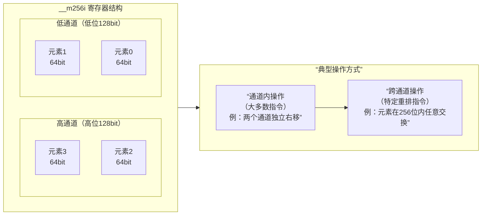

# SIMD Basic Knowledge

#SIMD

> [Writing C++ Wrappers for SIMD Intrinsics](https://johanmabille.github.io/blog/2014/10/09/writing-c-plus-plus-wrappers-for-simd-intrinsics-1/)

## 头文件

SSE/AVX指令主要定义于以下一些头文件中：

* `<xmmintrin.h>` : SSE, 支持同时对4个32位单精度浮点数的操作。
* `<emmintrin.h>` : SSE 2, 支持同时对2个64位双精度浮点数的操作。
* `<pmmintrin.h>` : SSE 3, 支持对SIMD寄存器的水平操作(horizontal operation)，如hadd, hsub等...。
* `<tmmintrin.h>` : SSSE 3, 增加了额外的instructions。
* `<smmintrin.h>` : SSE 4.1, 支持点乘以及更多的整形操作。
* `<nmmintrin.h>` : SSE 4.2, 增加了额外的instructions。
* `<immintrin.h>` : AVX, 支持同时操作8个单精度浮点数或4个双精度浮点数。

每一个头文件都包含了之前的所有头文件，所以如果你想要使用SSE4.2以及之前SSE3, SSE2, SSE中的所有函数就只需要包含<nmmintrin.h>头文件。

## 命名规则

* 数据类型通常以`_mxxx[T]`的方式进行命名。
  * 其中`xxx`代表数据的位数，如SSE提供的`__m128`为128位，AVX提供的`__m256`为256位。
  * `T`为类型，若为单精度浮点型则省略，若为整形则为`i`，如`__m128i`，若为双精度浮点型则为d，如`__m256d`。
* 操作浮点数的内置函数命名方式为：`_mm(xxx)_name_PT`。 
  * `xxx`为SIMD寄存器的位数，若为128则省略，如`_mm_addsub_ps`
  * `name`为函数执行的操作的名字，如加法为`_mm_add_ps`，减法为`_mm_sub_ps`
  * P代表的是对矢量(packed data vector)还是对标量(scalar)进行操作
  * T代表浮点数的类型，若为`s`则为单精度浮点型，若为`d`则为双精度浮点
* 操作整形的内置函数命名通常为：`_mm(XXX)_NAME_EPSYY`
  * `xxx`为SIMD寄存器的位数，若为128位则省略。
  * `name`为函数的名字。
  * `S`为整数的类型，若为无符号类型则为u，否在为i
  * `YY`为操作的数据类型的位数

## 函数类型

* 算术：`_mm_add_xx`, `_mm_sub_xx`, `_mm_mul_xx`, `_mm_div_xx`, …
* 逻辑：`_mm_and_xx`, `_mm_or_xx`, `_mm_xor_xx`, …
* 比较：`_mm_cmpeq_xx`, `_mm_cmpneq_xx`, `_mm_cmplt_xx`, …
* 转换：`_mm_cvtepixx`, …
* 内存拷贝：`_mm_load_xx`, `_mm_store_xx`, …
* 赋值：`_mm_set_xx`, `_mm_setzero_xx`, …

## Key Notes

### High & Low Lane

简单来说：

*   **通道**：一个宽SIMD寄存器（如256位）内部被划分成多个独立或半独立的**数据段**。许多指令只在这些段内并行操作，不跨越边界。
*   **跨通道重排**：使用特定指令**打破上述段间壁垒**，在更宽范围（如整个256位）内任意重组数据元素。

下面这张图直观地展示了 `__m256i` 寄存器的通道划分，以及跨通道重排与通道内重排的根本区别：



以 `__m256i` （256位）为例，它常被视为由**两个独立的128位“通道”**构成：

* **低通道**：寄存器的第0~127位（较低位部分）。
* **高通道**：寄存器的第128~255位（较高位部分）。

许多AVX/AVX2指令（尤其是从SSE扩展而来的）是 **“通道内”** 操作的。例如 `_mm256_srli_si256` （按字节逻辑右移），它会在高、低两个128位通道内**各自独立**进行移位，**通道之间数据不流动**。

```cpp
// 假设 vec 初始包含：[A, B, C, D] (每个字母代表一个64位整数)
__m256i shifted = _mm256_srli_si256(vec, 8); // 右移8字节（64位）
// 结果可能是：[0, A, 0, C] 而不是 [0, A, B, C]
```

跨通道重排就是为了解决上述限制。它允许你将数据元素在整个256位寄存器范围内（跨越128位通道边界）进行**任意位置的重新排列**。

很多数据重组需求无法通过通道内操作完成。例如：

* 将4个64位整数从 `[A, B, C, D]` 循环右移为 `[D, A, B, C]`。
* 矩阵转置时，需要将分散在不同通道的行列元素聚集。


### **3. 跨通道重排的典型指令与例子**

最核心、最常用的跨通道重排指令是 **`_mm256_permute4x64_epi64`** （AVX2）。

```cpp
#include <immintrin.h>
#include <stdio.h>

void print_m256i_epi64(__m256i vec, const char* name) {
    alignas(32) int64_t tmp[4];
    _mm256_store_si256((__m256i*)tmp, vec);
    printf("%s: [%lld, %lld, %lld, %lld]\n", name, tmp[3], tmp[2], tmp[1], tmp[0]);
}

int main() {
    // 初始化一个包含4个64位整数的向量
    __m256i vec = _mm256_setr_epi64x(100, 200, 300, 400); // 内存布局：[0]=100, [1]=200, [2]=300, [3]=400
    print_m256i_epi64(vec, "Original    ");

    // 例子1：完全逆序 [100, 200, 300, 400] -> [400, 300, 200, 100]
    // _MM_SHUFFLE(3,2,1,0) 表示：新向量的[3]号位取自旧向量的3号位(400)，
    //                          新[2]号位取自旧2号位(300)， 以此类推。
    __m256i reversed = _mm256_permute4x64_epi64(vec, _MM_SHUFFLE(0, 1, 2, 3));
    print_m256i_epi64(reversed, "Reversed    "); // 输出: [100, 200, 300, 400]? 注意打印顺序！

    // 例子2：将高通道的两个元素移到低通道 [100, 200, 300, 400] -> [300, 400, 100, 200]
    __m256i swapped = _mm256_permute4x64_epi64(vec, _MM_SHUFFLE(1, 0, 3, 2));
    print_m256i_epi64(swapped, "Swap Lanes  ");

    // 例子3：广播（复制）第二个元素到所有位置 [100, 200, 300, 400] -> [200, 200, 200, 200]
    __m256i broadcasted = _mm256_permute4x64_epi64(vec, _MM_SHUFFLE(1, 1, 1, 1));
    print_m256i_epi64(broadcasted, "Broadcast 2nd");

    // 例子4：实现你上一问的“从第64位开始加载”，得到 [B, C, D, 0] 即 [200, 300, 400, 0]
    // 我们想要：新[0]<-旧[1](200)， 新[1]<-旧[2](300)， 新[2]<-旧[3](400)， 新[3]<-0(需额外处理)
    __m256i shifted_right = _mm256_permute4x64_epi64(vec, _MM_SHUFFLE(2, 1, 1, 0));
    // 此时得到 [200, 300, 400, 300]， 最后一个是“垃圾”，需要清零高64位
    __m256i zero_mask = _mm256_set_epi64x(0, -1, -1, -1); // 高64位为0， 低192位全1
    __m256i result = _mm256_and_si256(shifted_right, zero_mask);
    print_m256i_epi64(result, "Shift Right 64");

    return 0;
}
```
