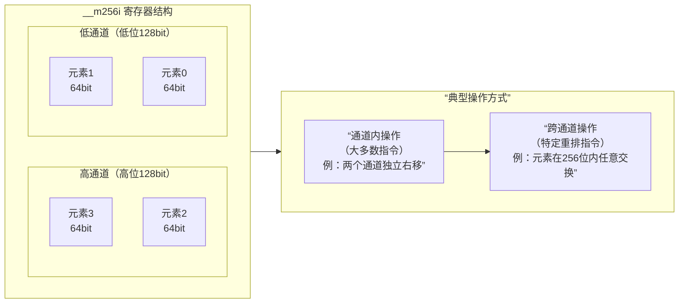

# SIMD Basic Knowledge

> [Writing C++ Wrappers for SIMD Intrinsics](https://johanmabille.github.io/blog/2014/10/09/writing-c-plus-plus-wrappers-for-simd-intrinsics-1/)
> 
> [Intel® Intrinsics Guide](https://www.intel.com/content/www/us/en/docs/intrinsics-guide/index.html#ig_expand=3730,5200,1884,4635,466&techs=SSE_ALL,AVX_ALL,AVX_512)

## 演进历史

Intel的SIMD指令集不断发展，其寄存器的位宽、数量和功能也随之演进。

| 特性维度 | **128位指令 (SSE)** | **256位指令 (AVX/AVX2)** | **512位指令 (AVX-512)** |
| :--- | :--- | :--- | :--- |
| **寄存器位宽** | 128位 | 256位 | 512位 |
| **寄存器名称** | `XMM0` - `XMM7` (32位模式)/ `XMM0` - `XMM15` (64位模式)  | `YMM0` - `YMM15`  | `ZMM0` - `ZMM31`  |
| **寄存器数量** | 8个 (32位)/ 16个 (64位)  | 16个  | 32个  |
| **单指令处理数据量示例** | 4个32位浮点数 或 2个64位双精度数 | 8个32位浮点数 或 4个64位双精度数 | 16个32位浮点数 或 8个64位双精度数 |
| **关键演进** | 引入独立的向量寄存器，支持单精度浮点数并行计算。 | 寄存器位宽翻倍，并引入更灵活的三操作数指令格式（如 `vd = va + vb`）。 | 寄存器位宽再次翻倍，数量增至32个，并引入强大的**掩码寄存器** 和更丰富的指令功能。 |

**在支持AVX-512的现代Intel CPU中，XMM、YMM和ZMM寄存器在物理上基本对应着同一个实体——一个更大的、512位宽的物理寄存器堆。** 但对于不支持更宽指令集的旧CPU，情况则不同。

* **早期CPU（仅支持SSE）**：
  * 当CPU只支持SSE时，芯片上有一个独立的**128位物理寄存器堆**，专门供XMM寄存器使用。此时，XMM寄存器是真正的物理实体。

* **过渡期CPU（支持AVX但不支持AVX-512）**：
  * 当引入AVX和YMM寄存器时，为了保持兼容性，**YMM寄存器的低128位与XMM寄存器共享相同的物理存储**。但YMM的高128位则需要新的物理空间。
  * 在这个阶段，可以理解为芯片上有一个**256位宽的物理寄存器堆**。当你访问`XMM0`时，硬件只使用这个物理寄存器的低128位；当你访问`YMM0`时，则使用全部256位。

* **现代CPU（支持AVX-512）**：
  * 如流程图所示，为了实现AVX-512，Intel设计了一个**统一的、512位宽的物理寄存器堆**。这个物理寄存器堆被所有的SIMD指令（SSE、AVX、AVX-512）所共享。
  * **ZMM**是这个512位物理寄存器的完整体现。
  * **YMM**被映射为这个物理寄存器的低256位。
  * **XMM**被映射为这个物理寄存器的低128位。
  * 这就是“嵌套”或“别名”关系的物理基础。**一个逻辑上的`ZMM0`，就对应一个完整的512位物理寄存器。逻辑上的`YMM0`和`XMM0`只是对同一物理寄存器不同位宽的“视图”或“访问窗口”。**

关键物理特性

* **功耗与面积**：512位的寄存器堆和与之连接的数据通路（如ALU）占据了巨大的芯片面积，并且功耗很高。这也是为什么AVX-512功能在某些情况下会导致CPU降频（称为“AVX-512频率偏移”），因为运行这些宽指令会产生大量热量。
* **高位清零**：当一条SSE指令（如`ADDPS XMM1, XMM2`）执行时，物理硬件会进行以下操作：
  1. 从物理寄存器堆中读取`XMM1`和`XMM2`对应的512位物理寄存器的**低128位**。
  2. 在128位的ALU上执行加法。
  3. 将结果写回目标物理寄存器的**低128位**。
  4. **同时，硬件会自动将该物理寄存器的[255:128]位和[511:256]位清零**。这就是为什么修改XMM寄存器会清零YMM和ZMM高位的原因，它在物理层面是通过写入掩码或控制电路实现的。

## 头文件

SSE/AVX指令主要定义于以下一些头文件中：

* `<xmmintrin.h>` : SSE, 支持同时对4个32位单精度浮点数的操作。
* `<emmintrin.h>` : SSE 2, 支持同时对2个64位双精度浮点数的操作。
* `<pmmintrin.h>` : SSE 3, 支持对SIMD寄存器的水平操作(horizontal operation)，如hadd, hsub等...。
* `<tmmintrin.h>` : SSSE 3, 增加了额外的instructions。
* `<smmintrin.h>` : SSE 4.1, 支持点乘以及更多的整形操作。
* `<nmmintrin.h>` : SSE 4.2, 增加了额外的instructions。
* `<immintrin.h>` : AVX, 支持同时操作8个单精度浮点数或4个双精度浮点数。

每一个头文件都包含了之前的所有头文件，所以如果你想要使用SSE4.2以及之前SSE3, SSE2, SSE中的所有函数就只需要包含<nmmintrin.h>头文件。

## 命名规则

* 数据类型通常以`_mxxx[T]`的方式进行命名。
  * 其中`xxx`代表数据的位数，如SSE提供的`__m128`为128位，AVX提供的`__m256`为256位。
  * `T`为类型，若为单精度浮点型则省略，若为整形则为`i`，如`__m128i`，若为双精度浮点型则为d，如`__m256d`。
* 操作浮点数的内置函数命名方式为：`_mm(xxx)_name_PT`。 
  * `xxx`为SIMD寄存器的位数，若为128则省略，如`_mm_addsub_ps`
  * `name`为函数执行的操作的名字，如加法为`_mm_add_ps`，减法为`_mm_sub_ps`
  * P代表的是对矢量(packed data vector)还是对标量(scalar)进行操作
  * T代表浮点数的类型，若为`s`则为单精度浮点型，若为`d`则为双精度浮点
* 操作整形的内置函数命名通常为：`_mm(XXX)_NAME_EPSYY`
  * `xxx`为SIMD寄存器的位数，若为128位则省略。
  * `name`为函数的名字。
  * `S`为整数的类型，若为无符号类型则为u，否在为i
  * `YY`为操作的数据类型的位数

## 函数类型

* 算术：`_mm_add_xx`, `_mm_sub_xx`, `_mm_mul_xx`, `_mm_div_xx`, …
* 逻辑：`_mm_and_xx`, `_mm_or_xx`, `_mm_xor_xx`, …
* 比较：`_mm_cmpeq_xx`, `_mm_cmpneq_xx`, `_mm_cmplt_xx`, …
* 转换：`_mm_cvtepixx`, …
* 内存拷贝：`_mm_load_xx`, `_mm_store_xx`, …
* 赋值：`_mm_set_xx`, `_mm_setzero_xx`, …

## Key Notes

### SIMD load 与字节序之间存在相互影响么

**总的来说，在指令集架构和软件层面上，我们普遍将寄存器描述为“左高右低”，即高位在左，低位在右。但在物理硬件层面，这个“左右”的概念并不直接存在。**

视角一：软件/指令集视角（逻辑视图）

在这个层面上，我们讨论的是寄存器的**逻辑布局**。无论是Intel/AMD的官方手册，还是编程教材，都使用 **“左高右低”** 的表示法，即最高有效位在左边，最低有效位在右边。

**以64位RAX寄存器为例：**

```shell
Bits: 63 ────────────────────────────────────────────────────────────────› 0
       |                                RAX                                |
```

**对于512位ZMM寄存器，我们同样如此描述：**

```shell
Bits: 511 ──────────────────────────────────────────────────────────────› 0
       |                                ZMM0                               |
```

**当我们处理更小的数据时，比如一个16位的整数 `0x1234` 存放在AX寄存器中：**

* `0x12` 是高位字节
* `0x34` 是低位字节

在逻辑视图下，我们会这样描述AX寄存器：

```shell
Bits: 15 ──────› 8   7 ──────› 0
       |    AH   |   |    AL   |
       |  0x12   |   |  0x34   |
```

**结论：从这个角度看，答案是肯定的，就是“左高右低”。这是一种便于人类理解和文档化的约定。**

视角二：硬件实现视角（物理视图）

在芯片的物理实现中，寄存器是由一排排的晶体管（如D触发器）构成的。它们分布在硅片上，有具体的物理位置。

1. **“左右”失去意义**：在物理层面，数亿个晶体管在二维平面上布局，谈论“左”和“右”是相对且任意的。硬件工程师更关心的是**时序、布线和功耗**。一个比特位在芯片上的具体物理位置与它在逻辑上的“位序”没有直接对应关系。

2. **真正的关键是“字节序”**：虽然单个比特位的物理排列对软件不可见，但**字节的排列顺序**对软件是可见的，这就是著名的**字节序**。
    * **小端序**：最低有效字节存储在最低的内存地址/寄存器位。
      * 例如，将 `0x12345678` 写入内存，地址从低到高存放的是 `78 56 34 12`。
    * **大端序**：最高有效字节存储在最低的内存地址/寄存器位。

    **x86/x86-64架构使用的是小端序**。这意味着当我们将一个32位值从寄存器写入内存时，最低的8位（AL）会进入最低的内存地址。

3. **硬件电路处理位序**：当执行一条指令，如 `add eax, ebx`，算术逻辑单元会正确地将最高有效位（第31位）到最低有效位（第0位）进行相加，无论这些比特位在物理上如何排列。硬件逻辑被设计成对软件呈现出一致的、符合“左高右低”逻辑视图的行为。

| 视角 | 寄存器比特位排列 | 说明 |
| :--- | :--- | :--- |
| **软件/逻辑视角** | **左高右低** | 这是**约定俗成的表示法**，用于文档、图表和编程理解。我们谈论寄存器的“第31位”时，指的就是这个逻辑位置。 |
| **硬件/物理视角** | **无绝对的“左右”概念** | 比特位的物理布局由芯片设计决定，对软件透明。硬件通过电路确保其行为符合逻辑视图的约定。硬件设计主要关心的是**字节序**，这在x86上是**小端序**。 |

### High & Low Lane

简单来说：

* **通道**：一个宽SIMD寄存器（如256位）内部被划分成多个独立或半独立的**数据段**。许多指令只在这些段内并行操作，不跨越边界。
* **跨通道重排**：使用特定指令**打破上述段间壁垒**，在更宽范围（如整个256位）内任意重组数据元素。

下面这张图直观地展示了 `__m256i` 寄存器的通道划分，以及跨通道重排与通道内重排的根本区别：



以 `__m256i` （256位）为例，它常被视为由**两个独立的128位“通道”**构成：

* **低通道**：寄存器的第0~127位（较低位部分）。
* **高通道**：寄存器的第128~255位（较高位部分）。

许多AVX/AVX2指令（尤其是从SSE扩展而来的）是 **“通道内”** 操作的。例如 `_mm256_srli_si256` （按字节逻辑右移），它会在高、低两个128位通道内**各自独立**进行移位，**通道之间数据不流动**。

```cpp
// 假设 vec 初始包含：[A, B, C, D] (每个字母代表一个64位整数)
__m256i shifted = _mm256_srli_si256(vec, 8); // 右移8字节（64位）
// 结果可能是：[0, A, 0, C] 而不是 [0, A, B, C]
```

跨通道重排就是为了解决上述限制。它允许你将数据元素在整个256位寄存器范围内（跨越128位通道边界）进行**任意位置的重新排列**。

很多数据重组需求无法通过通道内操作完成。例如：

* 将4个64位整数从 `[A, B, C, D]` 循环右移为 `[D, A, B, C]`。
* 矩阵转置时，需要将分散在不同通道的行列元素聚集。


### **3. 跨通道重排的典型指令与例子**

最核心、最常用的跨通道重排指令是 **`_mm256_permute4x64_epi64`** （AVX2）。

```cpp
#include <immintrin.h>
#include <stdio.h>

void print_m256i_epi64(__m256i vec, const char* name) {
    alignas(32) int64_t tmp[4];
    _mm256_store_si256((__m256i*)tmp, vec);
    printf("%s: [%lld, %lld, %lld, %lld]\n", name, tmp[3], tmp[2], tmp[1], tmp[0]);
}

int main() {
    // 初始化一个包含4个64位整数的向量
    __m256i vec = _mm256_setr_epi64x(100, 200, 300, 400); // 内存布局：[0]=100, [1]=200, [2]=300, [3]=400
    print_m256i_epi64(vec, "Original    ");

    // 例子1：完全逆序 [100, 200, 300, 400] -> [400, 300, 200, 100]
    // _MM_SHUFFLE(3,2,1,0) 表示：新向量的[3]号位取自旧向量的3号位(400)，
    //                          新[2]号位取自旧2号位(300)， 以此类推。
    __m256i reversed = _mm256_permute4x64_epi64(vec, _MM_SHUFFLE(0, 1, 2, 3));
    print_m256i_epi64(reversed, "Reversed    "); // 输出: [100, 200, 300, 400]? 注意打印顺序！

    // 例子2：将高通道的两个元素移到低通道 [100, 200, 300, 400] -> [300, 400, 100, 200]
    __m256i swapped = _mm256_permute4x64_epi64(vec, _MM_SHUFFLE(1, 0, 3, 2));
    print_m256i_epi64(swapped, "Swap Lanes  ");

    // 例子3：广播（复制）第二个元素到所有位置 [100, 200, 300, 400] -> [200, 200, 200, 200]
    __m256i broadcasted = _mm256_permute4x64_epi64(vec, _MM_SHUFFLE(1, 1, 1, 1));
    print_m256i_epi64(broadcasted, "Broadcast 2nd");

    // 例子4：实现你上一问的“从第64位开始加载”，得到 [B, C, D, 0] 即 [200, 300, 400, 0]
    // 我们想要：新[0]<-旧[1](200)， 新[1]<-旧[2](300)， 新[2]<-旧[3](400)， 新[3]<-0(需额外处理)
    __m256i shifted_right = _mm256_permute4x64_epi64(vec, _MM_SHUFFLE(2, 1, 1, 0));
    // 此时得到 [200, 300, 400, 300]， 最后一个是“垃圾”，需要清零高64位
    __m256i zero_mask = _mm256_set_epi64x(0, -1, -1, -1); // 高64位为0， 低192位全1
    __m256i result = _mm256_and_si256(shifted_right, zero_mask);
    print_m256i_epi64(result, "Shift Right 64");

    return 0;
}
```
